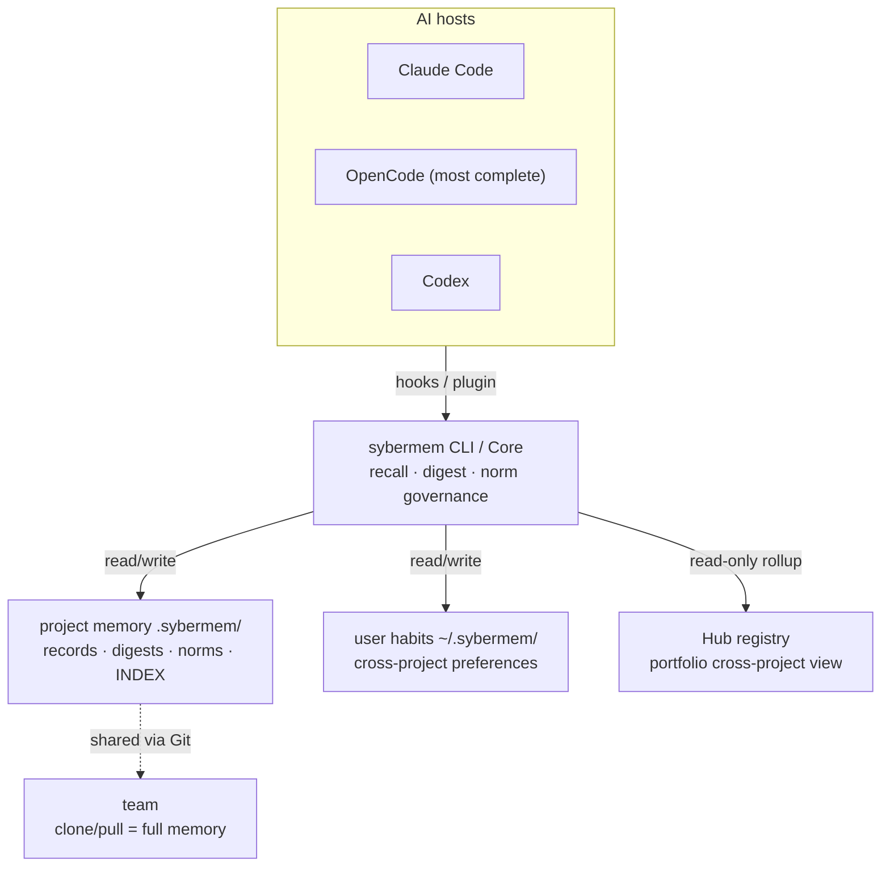

[中文](README.md) | **English**

# SyberMem

SyberMem is a project engineering-memory system for AI coding workflows. It stores context, decisions, rationale, and phase conclusions as local Markdown so the next session does not have to rebuild project history from scratch.

## Why It Exists

AI agents can move quickly inside one context window, but cross-session work often loses three important signals:

- why a design was chosen
- which problems were already found or fixed
- what the safest next step is now

SyberMem preserves those signals through structured records, derived indexes, phase/theme digests, and bounded read-only resume views. Data lives in the project's `.sybermem/` directory, so humans and AI agents can inspect it directly without relying on a black-box service.

## Architecture at a Glance



Memory is project-local Markdown shared through Git; each host injects the relevant memory into the model during a session via its own hook/plugin, all through the same CLI/Core — no second black-box store.

## Quick Start

```bash
# macOS / Linux
curl -sSL https://raw.githubusercontent.com/goudaren0528/sybermem/main/scripts/install-remote.sh | bash

# Windows (PowerShell)
irm https://raw.githubusercontent.com/goudaren0528/sybermem/main/scripts/install-remote.ps1 | iex

# Windows OpenCode / cmd.exe (PowerShell-free)
python -c "import urllib.request; exec(urllib.request.urlopen('https://raw.githubusercontent.com/goudaren0528/sybermem/main/scripts/install-remote.py').read())"
```

Then open a target project:

```text
/sybermem-init-project
/sybermem-record
/sybermem-resume
```

The usual loop is: initialize the project, record meaningful work after a session, then start the next session with `/sybermem-resume` to see the current phase, recent progress, risks, recommended next action, confidence, and freshness.

## What a Memory Record Looks Like

`/sybermem-record` writes Markdown records under `.sybermem/changes/`, `.sybermem/decisions/`, `.sybermem/requirements/`, or `.sybermem/bugs/`:

```markdown
---
type: change
record_id: change-6a3ab8a0e44e4c41843b66bde8b7134a
date: 2026-08-07
title: UUID-backed record IDs and derived project index
key_conclusion: Use UUID record IDs and a derived INDEX so parallel records merge safely
topics: [architecture, collaboration, quality]
implements: [requirement-002]
---

## Change Content
...

## Reason
...

## Impact Scope
...
```

`.sybermem/INDEX.md` is derived from canonical records and acts as the navigation and session-start key-conclusion layer. Long-term compression lives in phase digests and theme digests.

## Current Capabilities

### Project Memory

- structured records: `change` / `decision` / `requirement` / `bug` / `norm`
- UUID-backed `record_id` values, with legacy numeric record IDs still readable
- derived `.sybermem/INDEX.md` from canonical records
- phase digests and theme digests for phase/topic compression
- record relations: `implements` / `fixes` / `related` / `superseded_by` / `crystallized_from`
- read-only resume: `/sybermem-resume` and `sybermem resume`
- memory stats: `sybermem project memory-stats` prints 7d/30d terminal tables (record counts, type distribution, recall, Edit Alignment, digest/norm coverage, memory-injection lane distribution); `--format json` feeds `/sybermem-summary` and automation. See [Indexing and Search](#indexing-and-search)
- recall relevance feedback: at `session.idle`, OpenCode matches injected records against edited files; Codex does the same best-effort at `SessionEnd`. Both write bounded `.sybermem/.recall-outcomes.jsonl` / `.memory-usage.jsonl` rows via `related_files`, yielding precision-based `low_relevance` and anchor-coverage-based `low_measurability` verdicts distinct from frequency. See the [Feature Map](docs/feature_map.md)
- injection observability: OpenCode and Codex write memory that actually reached the model to the metadata-only `.sybermem/.memory-usage.jsonl` (lane totals, injected record ids, `session_outcome` summaries; no raw prompts or full injected text; write failures stay fail-open). See the [Feature Map](docs/feature_map.md)
- project search: `/sybermem-search` and `sybermem search`
- next-step guidance: `/using-sybermem` and `sybermem next-step`

### Digest Compression and Feedback

- phase/theme digests use a coverage hash for mechanical staleness detection: `sybermem digest status` reports current/stale/unknown verdicts
- digest backlog signal: `sybermem digest status --format json` carries a `backlog` object (records not covered by any digest + days since the last digest). A project that keeps recording but never digests gets a proactive "N records not yet in any digest" `⭐` heads-up at OpenCode `session.idle` and Claude/Codex `SessionStart`; the first-digest next-step recommendation now uses a digest-specific record threshold rather than the publish threshold
- digest results actually feed back: digests are in the search/recall corpus (with `related_digest` continuity links and stale conflict notes); `sybermem digest latest` returns the newest phase digest's Core Conclusions, which **all three hosts inject into model-visible context** — OpenCode at startup/compaction, Claude Code and Codex at `SessionStart` — so digest content is model-visible, not just a "go read it" pointer

### Project Norms (binding rules)

- first-class `norm` record type under `.sybermem/norms/`, distinct from user habits (user-level) and ordinary decisions
- fields: `scope` (`global` / `topic:x` / `path:x` / `tool:x`), an imperative `statement`, `authority: authoritative`, reusing the existing lifecycle + supersede machinery
- two feedback lanes: the always-on **constitution** (active global norms, max 5, injected once per session regardless of prompt relevance) plus **scoped recall** (non-global norms matched by scope tag or >=2 strong statement overlaps, without lowering the recall gate)
- identification (both confirmation-first, never auto-promote): explicit — the `/sybermem-record` closing step crystallizes a binding rule into a `norm` (with `crystallized_from` provenance); emergent — `sybermem norms nominate` deterministically detects constraints recurring across >=3 decision/requirement records and not covered by an active norm, surfaced at `/sybermem-digest` / `/sybermem-theme-digest`
- feedback reaches all three hosts: OpenCode (startup constitution + per-prompt scoped recall + `📏` toast + compaction constitution reuse), Claude Code (`SessionStart` constitution + `UserPromptSubmit` scoped), Codex (`SessionStart` constitution + `UserPromptSubmit` scoped)
- governance: `sybermem norms doctor` flags 2+ active norms in the same scope with overlapping statements (likely contradiction/duplication; non-zero exit for CI gating; advisory only, never edits); `sybermem norms list --scope global|scoped|all --context <text> --format json` is the single source of truth every host consumes

### Workspace / Hub

- project registry
- workspace SQLite FTS5 search index: `sybermem index build`
- workspace search with project, type, and status filters
- recovery guidance for missing, incompatible, or stale indexes
- portfolio view: `sybermem portfolio`
- cross-project view: `sybermem portfolio` aggregates each registered project (phase, open bugs/requirements, digest coverage, latest record date) read-only from the Hub registry — no separate Team repo or publish pipeline

### User Habit Memory

- user-level habit storage: `~/.sybermem/user-habits/`, or `SYBERMEM_HOME/user-habits/` in tests/custom environments
- explicit capture: `sybermem habit add --type workflow --applies-to planning "Prefer plans before implementation"`
- review and governance: `sybermem habit list`, `search`, `pause`, and `delete`
- visible reminders: `sybermem habit remind --context planning --format markdown` and `/sybermem-habit`
- manual/compaction injection: `sybermem habit inject --context planning --format markdown`
- prompt-time perceptible by default: `habit add` now defaults `injection_policy=prompt_ok_when_supported`, so a confirmed habit is injected at prompt time (`🧠`) on supported hosts without extra flags; relevance uses CJK-aware weighted matching (an `applies_to` tag match is a strong boost, otherwise >=2 distinct multi-char statement overlaps), so Chinese contexts match while unrelated habits stay silent
- passive candidate capture (candidate-only, never auto-written): when OpenCode `chat.message` detects reusable-preference language ("always…", "I prefer…"), it calls `sybermem habit intent --prompt <text>` to append a candidate to a **bounded candidate list** in the user-level `~/.sybermem/.habit-intent.json` (last 5, 10-day expiry, deduped by summary; never an active habit). Each candidate carries a `candidate_id`, a suggested type/scope, and a **bounded, secret/injection-filtered summary** of the triggering prompt (not the full raw text, mirroring the record-intent summary contract) so the confirm step can propose a normalized statement. `/sybermem-habit` opens with a status view of active habits + pending candidates; `habit intent-status` lists candidates; the user confirms one into a habit in a step (then `habit intent-discard <id>` removes that one), or `habit intent-clear` drops all
- injection visibility: once recall/habit/norms actually land in the same prompt, the plugin emits one bounded post-injection summary (total items / chars / lane counts); candidate capture emits a separate scope-aware `💡` (personal habit → `/sybermem-habit`, project convention → `/sybermem-record`, or asks when ambiguous), and startup context keeps its own one-shot notice
- awareness surface: `sybermem habit awareness` and the OpenCode first-turn startup context report the active-habit count, type distribution, and whether a candidate is pending (counts only, never statements, never duplicating prompt-time reminders)
- conservative gates: only active, high-confidence, directly relevant, non-excluded habits are injected, with a maximum of three
- habits are not stored in project `.sybermem/` records; a personal preference → habit, a binding project rule → crystallize a `norm` (see Project Norms)

## CLI vs Skill Boundaries

SyberMem has two execution paths with different reliability properties:

| Path | Representative capabilities | Notes |
|---|---|---|
| CLI / Core | `sybermem resume`, `search`, `next-step`, `portfolio`, `index build`, `project index build/check`, `project memory-stats`, `record id`, `habit add/list/search/pause/delete/remind/inject`, `digest status/latest`, `norms list/nominate/doctor`, `uninstall --scope project|global`, `project uninstall` | Programmatic and scriptable; best for deterministic queries |
| Skill orchestration | `/sybermem-record`, `/sybermem-habit`, `/sybermem-link`, `/sybermem-digest`, `/sybermem-theme-digest`, `/sybermem-phase-analyze`, `/sybermem-uninstall` | AI edits `.sybermem/` Markdown, invokes user-level habit CLI, or asks/confirms project vs global uninstall scope; best for work that requires judgment and synthesis |

`sybermem record id --type <change|decision|requirement|bug>` only mints a canonical record ID. Full record creation still happens through `/sybermem-record`.

## Platform Support

All three hosts can record, recall, and resume; **OpenCode is the most complete** — per-prompt recall, habit injection, and injection observability are all automatic and native.

| Platform | Automation | Integration |
|---|---|---|
| **OpenCode** | Most complete: automatic per-prompt recall + habit injection + injection observability | native TypeScript plugin (`chat.message` / `system.transform` seams) + skills |
| **Claude Code** | Full: session-start context + per-prompt reminders | plugin metadata + `SessionStart` / `UserPromptSubmit` / `Stop` hooks + skills |
| **Codex** | Bounded: startup context + per-prompt recall/reminders + metadata-only observability | `~/.agents/skills` + `SessionStart` / `UserPromptSubmit` / `SessionEnd` / `Stop` / `PostCompact` hooks (no hidden automation) |

All three share the same records, CLI/Core, and `.sybermem/` data; the difference is only the depth of injection automation. Per-host hook details and the full capability matrix live in the [Feature Map](docs/feature_map.md), [`.opencode/INSTALL.md`](.opencode/INSTALL.md), and [`.codex/INSTALL.md`](.codex/INSTALL.md).

## Install and Upgrade

### One-Line Install

See the install commands in [Quick Start](#quick-start) above (macOS / Linux, Windows PowerShell, and Windows PowerShell-free).

This refreshes user-level Claude Code skills, OpenCode skills, Codex skills (`~/.agents/skills`), the OpenCode plugin, the Codex `SessionStart` / `UserPromptSubmit` / `SessionEnd` / `Stop` / `PostCompact` hooks, and the CLI / Core runtime. The installer creates a fixed CLI launcher at `$HOME/.claude/sybermem/cli/sybermem` on macOS / Linux and `%USERPROFILE%\.claude\sybermem\cli\sybermem.cmd` on Windows. SyberMem's OpenCode plugin, Codex hooks, and CLI-using skills prefer this fixed launcher when a subprocess cannot resolve bare `sybermem`; install scripts do not modify persistent PATH by default.

### Validating from Source

Validation differs per platform:

- **OpenCode**: re-run the installer (or `python scripts/update.py` in a checkout) to refresh `~/.config/opencode/plugins/sybermem.ts`, then send a prompt that hits stored memory and watch for the `⭐`/`🧠`/`💡` toasts.
- **Claude Code**: `claude --plugin-dir .` loads the plugin, hooks, and skills straight from the checkout.
- **Codex**: re-run the installer and confirm the skills under `~/.agents/skills` and the `~/.codex/hooks/*.py` files (plus the `~/.codex/hooks.json` merge) are in place.

### Upgrade Order

1. Re-run the global install / update command first.
2. Open each existing project and run `/sybermem-update`.
3. For new projects, run `/sybermem-init-project`.

Installers write the installed version to `~/.claude/sybermem/VERSION`, and `sybermem project refresh` stamps `sybermem_version` into the project's `.sybermem/project.yaml`. When a project trails the installed SyberMem, session-start surfaces a throttled, fail-open `⭐ run /sybermem-update` nudge (OpenCode `session.created` toast; Claude/Codex `SessionStart` context). Run `sybermem doctor` any time to see installed vs project version.

The global refresh updates user-level runtime, Claude/OpenCode/Codex skills, the OpenCode plugin, and the Codex user-level hooks. Project-local `.sybermem/`, hooks, templates, and instruction files are refreshed by `/sybermem-update`. `/sybermem-update` now calls `sybermem project refresh --format json` first for scriptable project-local refresh, falling back to agent-orchestrated `/sybermem-init-project` only when the CLI is missing, exits nonzero, or emits invalid JSON. Codex health checks treat `~/.agents/skills/sybermem-init-project/project-files` as one template source, so the Codex install path participates in project freshness checks. Old users who need the new OpenCode/Codex habit-reminder, record-intent metadata, recall debug logging, actual-injection observability, `.memory-usage.jsonl`, Codex `SessionEnd` outcomes, or OpenCode `prompt-memory-injected` summary toast path should re-run the global install/update first to refresh CLI/Core, `~/.config/opencode/plugins/sybermem.ts`, and `~/.codex/hooks/*.py`, then run `/sybermem-update` in the project; `project refresh` does not scaffold `.memory-usage.jsonl` or other runtime logs. The same order applies to fixes for the CLI launcher, OpenCode plugin, Codex hook, or skill instructions.

## Initialize a Project

Run this in the target project:

```text
/sybermem-init-project
```

It creates or refreshes:

- `.sybermem/`
- `.sybermem/digests/`
- `.sybermem/theme-digests/`
- `.sybermem/analysis/phase-index.md`
- `.sybermem/project.yaml`
- `.sybermem/hooks/`
- `.claude/settings.json`

If a project already has custom `.claude/settings.json` content, SyberMem patches only recognized managed entries and does not overwrite unrelated hooks, env, or instructions. SyberMem no longer injects into `CLAUDE.md` / `AGENTS.md`; init/update removes any legacy SyberMem protocol block left by older versions (deleting the whole file when it is purely SyberMem-managed, otherwise stripping only the block and preserving user content).

## Daily Usage

### Project Owner

- `/sybermem-resume`: get a bounded read-only resume view
- `/sybermem-record`: record a meaningful round of work; at closeout, crystallize a binding project rule into a `norm`
- `/sybermem-search`: search historical records
- `/sybermem-habit`: add, review, pause, delete, or remind user-level habits
- `/sybermem-uninstall`: natural-language uninstall entrypoint; asks project vs global scope when unclear, and requires explicit confirmation for global uninstall
- `/sybermem-summary`: inspect current project state
- `sybermem norms list/nominate/doctor`: view the project-norm constitution, nominate recurring constraints, detect same-scope conflicts
- `/sybermem-digest`: capture a stable phase conclusion
- `/sybermem-theme-digest`: capture a cross-phase topic conclusion

### Cross-Project View

- `sybermem portfolio`: read-only aggregate of each registered project (phase, open bugs/requirements, digest coverage, latest record date)

### When Unsure What To Do Next

- `/sybermem-resume` (slash skill): restore current context first
- `/using-sybermem` (slash skill): inspect state and get the recommended command
- `sybermem next-step` (terminal CLI command, **not** a slash command — there is no `/sybermem-next-step`): get next-step guidance directly; `/using-sybermem` calls it internally, and it shares the same router as `/sybermem-resume`, so they agree

## Indexing and Search

- `.sybermem/INDEX.md` is a derived project navigation file rebuilt by `sybermem project index build` and checked by `sybermem project index check`.
- `sybermem project phase analyze` deterministically groups records and atomically rewrites `.sybermem/analysis/phase-index.md` (confirmed phases + coverage map + `status: analyzed`), so phase analysis is never silently lost to a hand-written Markdown step. Phase grouping is an agent judgement: the agent reads the full record history and produces a semantic grouping, persisted with `sybermem project phase analyze --from-json <file>` (`{ "phases": [ { "title": "...", "covered_records": [...] } ] }`) after coverage validation; mechanical grouping (without `--from-json`, month+topic buckets) is only a fallback when the agent cannot produce a semantic grouping. `/sybermem-phase-analyze` prefers this CLI and falls back to agent orchestration only when the CLI is missing, broken, or emits invalid JSON.
- `sybermem project coverage-hash --phase-id phase-NNN --format json` resolves a phase's covered records to real file paths (by each record's frontmatter `record_id:`, never by filename) and returns `source_records` plus a deterministic `coverage_hash`, which `/sybermem-digest` uses to fill the digest `coverage_hash` field; `--source-records <relpaths>` hashes an explicit source set instead.
- `sybermem project memory-stats` renders 7d/30d tables for record counts, type distribution, recall events, injected/abstained counts, recall rate, Edit Alignment, and Memory injection turns/items/chars, avg chars/turn, p95 chars/turn, plus 30d lane distribution; `--format json` is available for skills and automation. Recall frequency comes from `.sybermem/.recall-debug.jsonl`, while Edit Alignment and memory-injection observability come from the OpenCode/Codex-written `.sybermem/.recall-outcomes.jsonl` and `.sybermem/.memory-usage.jsonl`. A missing log means stats are unavailable, not that recall activity was zero. Edit Alignment is an edit-anchored proxy based on `related_files`, not semantic accuracy, and it exposes hit, measurable, unmeasurable, and evidence availability. Codex Edit Alignment comes from a `SessionEnd` git-diff approximation, not OpenCode's per-event edit telemetry. The `recall_health` `low_relevance` verdict fires only when injected samples are sufficient and this proxy is below the floor, distinct from frequency-based `low_signal`; `low_measurability` separately flags projects where recall fires but too many records lack verifiable `related_files` anchors.
- `sybermem project record-files --ids <a,b> --format json` maps record ids to their `related_files`, so OpenCode recall relevance reuses Core's Markdown parsing.
- `sybermem index build` builds the workspace SQLite FTS5 index for cross-project search.
- Project search defaults to lexical matching and scoring over parsed Markdown records. Alongside `title` / `topics` / relations / body, `key_conclusion` is now a first-class high-weight signal, and `related_files` adds a capped path/module boost and tie-break. Explicit project search can also do one-hop typed relation expansion: when a query directly hits a `record_id`, or reaches a typed relation match first, search may surface the linked record with `match: relation-expanded` plus `expanded_from` and `expansion_relation` provenance in JSON or other machine-readable outputs. `sybermem context recall --format json` exposes machine-readable matched fields, score breakdowns, and that expansion provenance, while prompt-time Markdown packets stay compact and do not include verbose explanations. Use the workspace index for cross-project search.
- Prompt-time recall keeps the stricter shared `context recall` gate: only after a high-signal seed qualifies may it append at most one non-evidence one-hop relation expansion per seed, with at most two total expansions in the packet. Weak keyword-only, topic-only, or semantic-only matches do not expand and do not auto-inject into every prompt.
- Optional `SYBERMEM_SEMANTIC_RECALL=1` enables a local char n-gram recall supplement for explicit search. It does not trigger weak expansion and does not automatically inject recall into every prompt.

## Cross-Project Collaboration

Teams collaborate by sharing each repo's `.sybermem/` directly through Git: anyone who clones/pulls gets the full project engineering memory locally, and the agent hooks/plugins apply it during their own development. For a read-only view across multiple repos, use `sybermem portfolio` (Hub-registry based — no separate Team repo or publish pipeline).

> Note: the earlier standalone "Team memory" publication subsystem (`sybermem team`/`publish`, `/sybermem-team-*`) has been removed — it was redundant for a single team sharing one repo via Git (see CHANGELOG). Existing external Team repositories and `.sybermem/` history are unaffected.

## Repository Structure

```text
.claude-plugin/                      # Claude Code plugin metadata and marketplace manifest
hooks/                               # Claude Code hook declarations and delegators
skills/                              # Plugin-facing skills tree
packages/claude-skills/              # Skill source for distribution
packages/core/                       # Core memory / norm & digest governance logic
packages/cli/                        # sybermem CLI
packages/opencode-plugin/            # OpenCode plugin
.codex-plugin/                       # Codex marketplace/entry metadata
.codex/                              # Codex install notes and bounded habit hook
scripts/                             # Install, update, uninstall, and package-check scripts
```

## Uninstall

### Project-Level Uninstall

```text
sybermem project uninstall
sybermem uninstall --scope project
```

This deactivates SyberMem runtime management in the project while preserving `.sybermem/` history and removing only managed hook / env / instruction-block content where possible.

### Global Uninstall

```text
sybermem uninstall --scope global --yes
```

```bash
# Windows (PowerShell)
.\scripts\uninstall.ps1

# macOS / Linux
./scripts/uninstall.sh
```

Global uninstall removes user-level skills, CLI, launchers, and the OpenCode plugin. It does not delete `.sybermem/` history from any project. Use `/sybermem-uninstall` for natural-language uninstall routing; when scope is unclear, it asks whether you want project-level deactivation or global removal, and global removal requires explicit confirmation.

## Compatibility

- `.sybermem/` is the canonical project data directory, shareable via Git.
- Per-host prompt-time recall and injection differences are covered in [Platform Support](#platform-support); implementation details live in each platform's INSTALL.
- For more installation, upgrade, and compatibility details, see [INSTALL.md](INSTALL.md).

## License

MIT
