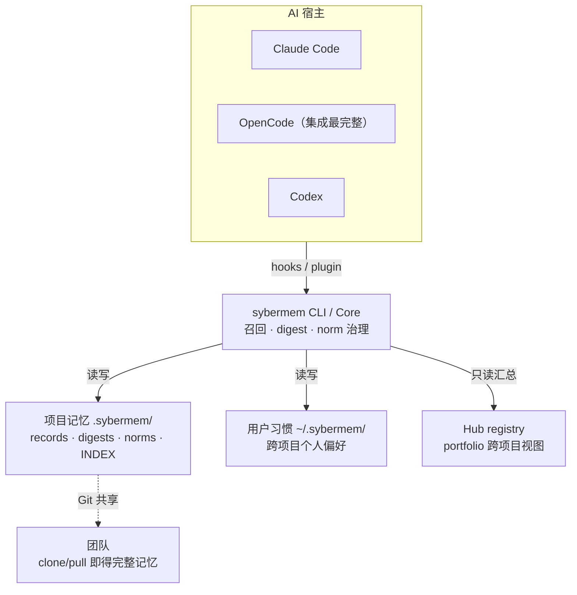

**中文** | [English](README.en.md)

# SyberMem

SyberMem 是面向 AI 编程工作流的项目工程记忆系统。它把一次工作的背景、决策、原因和阶段结论沉淀为本地 Markdown，让下一次会话不必从零重建上下文。

## 为什么需要它

AI agent 很擅长在当前窗口里推进工作，但跨会话后容易丢掉三个关键信号：

- 之前为什么这么设计
- 哪些问题已经踩过或修过
- 当前项目最安全的下一步是什么

SyberMem 用结构化 records、可派生索引、阶段 / 主题 digest 和只读续接视图保存这些信号。数据保存在项目本地的 `.sybermem/` 目录中，人和 AI 都能直接审阅，不是黑盒服务。

## 架构总览



记忆是项目本地的 Markdown，随 Git 共享；宿主通过各自的 hook/plugin 把相关记忆在会话内注入模型，全部经由同一个 CLI/Core，避免第二套黑盒存储。

## 快速开始

```bash
# macOS / Linux
curl -sSL https://raw.githubusercontent.com/goudaren0528/sybermem/main/scripts/install-remote.sh | bash

# Windows (PowerShell)
irm https://raw.githubusercontent.com/goudaren0528/sybermem/main/scripts/install-remote.ps1 | iex

# Windows OpenCode / cmd.exe (PowerShell-free)
python -c "import urllib.request; exec(urllib.request.urlopen('https://raw.githubusercontent.com/goudaren0528/sybermem/main/scripts/install-remote.py').read())"
```

安装后进入目标项目：

```text
/sybermem-init-project
/sybermem-record
/sybermem-resume
```

典型节奏是：初始化项目，完成一轮有价值的工作后记录它，下次打开项目先用 `/sybermem-resume` 获取当前阶段、最近进展、风险、建议下一步、置信度和信息新鲜度。

## 一条记忆长什么样

`/sybermem-record` 会在 `.sybermem/changes/`、`.sybermem/decisions/`、`.sybermem/requirements/` 或 `.sybermem/bugs/` 下写入 Markdown record：

```markdown
---
type: change
record_id: change-6a3ab8a0e44e4c41843b66bde8b7134a
date: 2026-08-07
title: UUID-backed record IDs and derived project index
key_conclusion: 采用 UUID record_id 和派生 INDEX，让并行记录安全合并
topics: [architecture, collaboration, quality]
implements: [requirement-002]
---

## Change Content
...

## Reason
...

## Impact Scope
...
```

`.sybermem/INDEX.md` 由 canonical records 派生重建，用作导航和会话启动的关键结论层。真正的长期压缩层是 phase digest 和 theme digest。

## 当前能力

### Project memory

- 结构化 records：`change` / `decision` / `requirement` / `bug` / `norm`
- UUID-backed `record_id`，并兼容旧 numeric record ID
- 从 canonical records 派生的 `.sybermem/INDEX.md`
- phase digest 与 theme digest，用于阶段和主题级压缩
- record 关系：`implements` / `fixes` / `related` / `superseded_by` / `crystallized_from`
- 只读续接：`/sybermem-resume` 与 `sybermem resume`
- 记忆统计：`sybermem project memory-stats` 打印 7 天 / 30 天终端表格（record 计数、类型分布、recall、Edit Alignment、digest / norm 覆盖、memory injection lane 分布）；`--format json` 供 `/sybermem-summary` 与自动化消费。详见[索引与检索](#索引与检索)
- 召回相关性反馈：OpenCode 在 `session.idle` 把召回注入过的记录与实际编辑文件（按 `related_files`）比对，写入有界 `.sybermem/.recall-outcomes.jsonl` / `.memory-usage.jsonl`，得出频率之外的 `low_relevance`（精准度）与 `low_measurability`（锚点不足）判定。详见 [Feature Map](docs/feature_map.md)
- 注入可观测性：本阶段只有 OpenCode 会把实际进入模型的记忆写入 metadata-only 的 `.sybermem/.memory-usage.jsonl`（含 lane totals、注入 record ids 与 `session_outcome` 汇总，不保存原始 prompt / 完整注入文本，写入失败 fail-open）。详见 [Feature Map](docs/feature_map.md)
- 项目内检索：`/sybermem-search` 与 `sybermem search`
- 下一步建议：`/using-sybermem` 与 `sybermem next-step`

### Digest 沉淀与反哺

- phase / theme digest 用 coverage hash 做机械陈旧检测：`sybermem digest status` 给出 current/stale/unknown 判定
- digest 积压信号：`sybermem digest status --format json` 带 `backlog`（未被任何 digest 覆盖的 record 数 + 距上次 digest 天数）。已经做过一次 digest 后仍持续记录的项目，会在 OpenCode `session.idle`、Claude/Codex `SessionStart` 得到"N 条记录尚未进入任何 digest"的 `⭐` 提醒；`next-step` 首次 digest 推荐改用 digest 专属的记录数阈值（而非发布阈值）
- digest 结果真正反哺：digest 进入搜索/召回语料（带 `related_digest` 连续性关联和 stale 冲突标注）；`sybermem digest latest` 返回最新 phase digest 的 Core Conclusions，**三宿主都会把它注入模型可见上下文**——OpenCode 在 startup / compaction、Claude Code 与 Codex 在 `SessionStart`——digest 内容对模型可见，而不仅仅是"去读"指针

### Project Norms（项目规范 / 约束）

- 一等 `norm` record 类型，存于 `.sybermem/norms/`，区别于个人 habit（用户级）和普通 decision
- 字段：`scope`（`global` / `topic:x` / `path:x` / `tool:x`）、祈使 `statement`、`authority: authoritative`，复用已有 lifecycle + supersede 机制
- 双通道反哺：**宪法**（active 全局 norm，最多 5 条，每会话开场恒注入，与 prompt 相关性无关）+ **域内召回**（非全局 norm 按 scope tag 或 ≥2 个强语句重叠命中，不降低召回门槛）
- 识别（都 confirmation-first，绝不自动固化）：显式——`/sybermem-record` 收尾把绑定规则固化为 `norm`（带 `crystallized_from` 溯源）；涌现——`sybermem norms nominate` 确定性地检测跨 ≥3 条 decision/requirement 反复出现、且未被现有 norm 覆盖的约束，在 `/sybermem-digest` / `/sybermem-theme-digest` 收尾提名
- 反哺覆盖三宿主：OpenCode（startup 宪法 + 每-prompt 域内召回 + `📏` toast + compaction 复用宪法）、Claude Code（`SessionStart` 宪法 + `UserPromptSubmit` 域内）、Codex（`SessionStart` 宪法 + `UserPromptSubmit` 域内）
- 治理：`sybermem norms doctor` 检测同 scope 内重叠的多条 active norm（疑似矛盾/重复，CI 可据非零退出码拦截，仅提示不改写）；`sybermem norms list --scope global|scoped|all --context <text> --format json` 是所有宿主共用的单一事实源

### Workspace / Hub

- project registry
- workspace SQLite FTS5 搜索索引：`sybermem index build`
- workspace search 支持项目、类型和状态过滤
- index 缺失、schema 过期或 stale 时给出恢复提示
- portfolio 视图：`sybermem portfolio`
- 跨项目组合视图：`sybermem portfolio` 基于 Hub registry 只读汇总各已注册项目的阶段、未决 bug/需求、digest 覆盖与最近记录日期（不需要单独的 Team 仓库或发布流程）

### User Habit Memory

- 用户级习惯存储：`~/.sybermem/user-habits/`，或测试/自定义环境中的 `SYBERMEM_HOME/user-habits/`
- 显式记录：`sybermem habit add --type workflow --applies-to planning "Prefer plans before implementation"`
- 查看与治理：`sybermem habit list`、`search`、`pause`、`delete`
- 可见提醒：`sybermem habit remind --context planning --format markdown` 与 `/sybermem-habit`
- 手动/compaction 注入：`sybermem habit inject --context planning --format markdown`
- 默认 prompt-time 可感知：`habit add` 默认 `injection_policy=prompt_ok_when_supported`，确认过的习惯在支持的宿主上开箱即可在逐 prompt 注入（弹 `🧠`），无需额外参数；相关性用 CJK 感知的加权匹配（命中 `applies_to` tag 为强信号，否则需 ≥2 个多字符语句重叠），中文上下文可命中，无关习惯保持静默
- 被动候选捕获（仅候选，永不自动写入）：OpenCode `chat.message` 检测到"以后都…/我习惯…"这类可复用偏好时，调用 `sybermem habit intent --prompt <text>` 把候选追加到用户级 `~/.sybermem/.habit-intent.json` 的**有界候选列表**（最近 5 条、10 天过期、按 summary 去重；绝不创建 active habit）。候选带 `candidate_id`、建议 type/scope，以及一段**有界、过密钥/注入过滤的 prompt 摘要**（不是完整原文，与 record-intent 的摘要契约一致），供确认时据此提议规范化 statement。`/sybermem-habit` 默认先展示 active + pending 状态视图，`habit intent-status` 列出候选，用户可一键确认某条转为 habit（随后 `habit intent-discard <id>` 单条清除），或 `habit intent-clear` 清空全部
- 注入可见性：同轮真正注入 recall / habit / 规范后只弹一条有界 post-injection summary（total items / chars / lane counts）；捕获候选时另弹 scope 感知的 `💡`（个人习惯→`/sybermem-habit`，项目约定→`/sybermem-record`，模糊时追问），startup context 用独立一次性提示
- 感知层：`sybermem habit awareness` 及 OpenCode 首轮 startup context 展示 active 习惯数量、类型分布与是否有待确认候选（只报数量，不暴露 habit 内容，也不与逐 prompt 提醒重复）
- 保守门槛：只注入 active、高置信、未被排除、与上下文直接相关的习惯，最多 3 条
- 默认不进入项目 `.sybermem/` records；个人偏好 → habit，绑定的项目规则 → 固化为 `norm`（见 Project Norms）

## CLI 与 Skill 的边界

SyberMem 有两类执行路径，可靠性不同：

| 路径 | 代表能力 | 说明 |
|---|---|---|
| CLI / Core | `sybermem resume`、`search`、`next-step`、`portfolio`、`index build`、`project index build/check`、`project memory-stats`、`record id`、`habit add/list/search/pause/delete/remind/inject`、`digest status/latest`、`norms list/nominate/doctor`、`uninstall --scope project|global`、`project uninstall` | 程序执行，可脚本化，适合确定性查询 |
| Skill 编排 | `/sybermem-record`、`/sybermem-habit`、`/sybermem-link`、`/sybermem-digest`、`/sybermem-theme-digest`、`/sybermem-phase-analyze`、`/sybermem-uninstall` | 由 AI 按 skill 指令编辑 `.sybermem/` Markdown、调用用户级 habit CLI，或在卸载时询问/确认项目级与全局 scope，适合需要判断和整理的工作 |

`sybermem record id --type <change|decision|requirement|bug>` 只生成 canonical record ID；完整 record 创建仍通过 `/sybermem-record` 完成。

## 平台支持

三个宿主都能记录、召回、resume；**OpenCode 集成最完整**——逐-prompt 召回、习惯提醒、注入可观测性全部自动、原生。

| 平台 | 自动化程度 | 接入方式 |
|---|---|---|
| **OpenCode** | 最完整：逐-prompt 自动召回 + 习惯注入 + 注入可观测性 | 原生 TypeScript plugin（`chat.message` / `system.transform` 等 seam）+ skills |
| **Claude Code** | 完整：会话启动上下文 + 逐-prompt 提醒 | plugin metadata + `SessionStart` / `UserPromptSubmit` / `Stop` hooks + skills |
| **Codex** | 有界：启动上下文 + 逐-prompt 召回/提醒 | `~/.agents/skills` + `SessionStart` / `UserPromptSubmit` / `Stop` / `PostCompact` hooks（无隐藏自动化） |

三平台共享同一套 records、CLI/Core 与 `.sybermem/` 数据，差异只在「注入自动化」的深度。逐宿主的 hook 细节与完整功能矩阵见 [Feature Map](docs/feature_map.md)、[`.opencode/INSTALL.md`](.opencode/INSTALL.md) 与 [`.codex/INSTALL.md`](.codex/INSTALL.md)。

## 安装与升级

### 一行式安装

安装命令见上文[快速开始](#快速开始)（提供 macOS / Linux、Windows PowerShell、Windows PowerShell-free 三种）。

这会刷新用户级 Claude Code skills、OpenCode skills、Codex skills（`~/.agents/skills`）、OpenCode plugin、Codex `SessionStart` / `UserPromptSubmit` / `Stop` / `PostCompact` hooks，以及 CLI / Core runtime。安装器会创建固定 CLI launcher：macOS / Linux 为 `$HOME/.claude/sybermem/cli/sybermem`，Windows 为 `%USERPROFILE%\.claude\sybermem\cli\sybermem.cmd`。SyberMem 的 OpenCode plugin、Codex hooks 和 CLI 型 skills 在子进程找不到裸 `sybermem` 时会优先使用这个固定 launcher；安装脚本默认不修改持久 PATH。

### 从源码验证

各平台验证方式不同：

- **OpenCode**：重跑安装器（或 checkout 内 `python scripts/update.py`）刷新 `~/.config/opencode/plugins/sybermem.ts`，然后在会话里发一个命中记忆的 prompt，看是否弹出 `⭐`/`🧠`/`💡` toast。
- **Claude Code**：`claude --plugin-dir .` 直接从 checkout 加载插件、hooks 与 skills。
- **Codex**：重跑安装器，确认 `~/.agents/skills` 下的 skills 与 `~/.codex/hooks/*.py`（及 `~/.codex/hooks.json` 合并项）已就位。

### 升级顺序

1. 先重新运行全局安装 / 更新命令。
2. 再进入已有项目运行 `/sybermem-update`。
3. 新项目运行 `/sybermem-init-project`。

安装器会把已安装版本写入 `~/.claude/sybermem/VERSION`；`sybermem project refresh` 会在项目 `.sybermem/project.yaml` 写入 `sybermem_version`。当某个项目落后于已安装版本时，会话启动会给出一条节流、fail-open 的 `⭐ 运行 /sybermem-update` 提醒（OpenCode `session.created` toast；Claude/Codex `SessionStart` 上下文）。随时可用 `sybermem doctor` 查看已安装版本与当前项目版本。

全局刷新只更新用户级 runtime、Claude/OpenCode/Codex skills、OpenCode plugin 和 Codex 用户级 hooks；项目内的 `.sybermem/`、hooks、模板和说明文件需要 `/sybermem-update` 才会刷新。`/sybermem-update` 会优先调用 `sybermem project refresh --format json` 做可脚本化的项目内刷新，只有 CLI 缺失、执行失败或输出非 JSON 时才回退到 agent 编排的 `/sybermem-init-project`。Codex 的健康检查会把 `~/.agents/skills/sybermem-init-project/project-files` 作为模板来源之一，因此 Codex 安装路径也能参与项目 freshness 检查。老用户要拿到 OpenCode 新的 habit reminder、record-intent metadata、recall debug logging、actual-injection observability、`.memory-usage.jsonl` 或 `prompt-memory-injected` summary toast 链路，先重跑全局安装/更新以刷新 CLI/Core 与 `~/.config/opencode/plugins/sybermem.ts`，再进项目跑 `/sybermem-update`；`project refresh` 不会脚手架创建 `.memory-usage.jsonl` 这类 runtime log。若修复的是 CLI launcher、OpenCode plugin、Codex hook 或 skill 指令链路，也按这个顺序生效。

## 初始化项目

在目标项目中运行：

```text
/sybermem-init-project
```

它会创建或刷新：

- `.sybermem/`
- `.sybermem/digests/`
- `.sybermem/theme-digests/`
- `.sybermem/analysis/phase-index.md`
- `.sybermem/project.yaml`
- `.sybermem/hooks/`
- `.claude/settings.json`

如果项目已有自定义 `.claude/settings.json`，SyberMem 只会补丁可识别的受管项，不覆盖无关 hooks、env 或说明。SyberMem 不再向 `CLAUDE.md` / `AGENTS.md` 注入内容；init/update 会移除旧版本遗留的 SyberMem 协议块（若文件仅含该块则删除整个文件，否则只移除块并保留用户内容）。

## 日常使用

### 项目 owner

- `/sybermem-resume`：获取只读续接视图
- `/sybermem-record`：记录一轮有价值的工作；收尾时可把绑定的项目规则固化为 `norm`
- `/sybermem-search`：查找历史 records
- `/sybermem-habit`：记录、查看、暂停、删除用户级习惯，或触发可见提醒
- `/sybermem-uninstall`：自然语言卸载入口；不明确时询问项目级或全局，且全局卸载需显式确认
- `/sybermem-summary`：查看当前项目状态
- `sybermem norms list/nominate/doctor`：查看项目规范宪法、提名重复约束、检测同 scope 冲突
- `/sybermem-digest`：沉淀稳定阶段结论
- `/sybermem-theme-digest`：沉淀跨阶段主题结论

### 跨项目视图

- `sybermem portfolio`：只读汇总各已注册项目（阶段、未决 bug/需求、digest 覆盖、最近记录日期）

### 不确定下一步时

- `/sybermem-resume`（slash skill）：先恢复当前上下文
- `/using-sybermem`（slash skill）：检查当前状态并获得推荐命令
- `sybermem next-step`（终端 CLI 命令，**不是** slash 命令，没有 `/sybermem-next-step`）：用 CLI 直接获取下一步建议；`/using-sybermem` 内部也调用它，两者与 `/sybermem-resume` 使用同一个路由，结论一致

## 索引与检索

- `.sybermem/INDEX.md` 是项目内派生导航文件，由 `sybermem project index build` 重建，由 `sybermem project index check` 校验。
- `sybermem project phase analyze` 会确定性地对记录分组并原子写回 `.sybermem/analysis/phase-index.md`（confirmed phases + coverage map + `status: analyzed`），使阶段分析结果不会因为手写 Markdown 而静默丢失。阶段分组是 agent 判断：agent 读取完整 record 历史产出语义分组，用 `sybermem project phase analyze --from-json <file>`（`{ "phases": [ { "title": "...", "covered_records": [...] } ] }`）校验覆盖后确定性落盘；机械分组（不带 `--from-json`，按月份+主题分桶）仅在 agent 无法产出语义分组时兜底。`/sybermem-phase-analyze` 优先走该 CLI，仅在 CLI 缺失、执行失败或输出非 JSON 时回退 agent 编排。
- `sybermem project coverage-hash --phase-id phase-NNN --format json` 把某阶段的 covered record 解析为真实文件路径（依据各记录 frontmatter `record_id:`，而非文件名）并返回 `source_records` 与确定性的 `coverage_hash`，供 `/sybermem-digest` 填充 digest 的 `coverage_hash` 字段；也可用 `--source-records <relpaths>` 直接对指定源计算哈希。
- `sybermem project memory-stats` 以表格展示最近 7 天 / 30 天的 record 数量、类型分布、recall events、injected/abstained、recall rate、Edit Alignment，以及 Memory injection 的 turns/items/chars、avg chars/turn、p95 chars/turn 和 30d lane distribution；`--format json` 给 skill 和自动化消费。召回频率指标来自 `.sybermem/.recall-debug.jsonl`，Edit Alignment 与 memory injection observability 来自 OpenCode 写入的 `.sybermem/.recall-outcomes.jsonl` 和 `.sybermem/.memory-usage.jsonl`；没有对应日志表示统计不可用，不代表召回活动为 0。Edit Alignment 只是按 `related_files` 锚点计算的编辑对齐代理，不代表语义准确率；它会同时暴露 hit、measurable、unmeasurable 和 evidence availability。`recall_health` 的 `low_relevance` 判定在注入样本足够且该代理值低于阈值时才触发，与频率型 `low_signal` 区分；当召回在触发但太多记录缺少可验证 `related_files` 锚点时，会给出独立的 `low_measurability` 建议。
- `sybermem project record-files --ids <a,b> --format json` 把记录 id 映射到其 `related_files`，供 OpenCode 召回相关性判定复用 Core 的 Markdown 解析。
- `sybermem index build` 构建 workspace 级 SQLite FTS5 索引，服务于跨项目搜索。
- 项目内检索默认基于已解析 Markdown records 的词法匹配和打分；`title` / `topics` / relation / body 之外，`key_conclusion` 作为一等高权重信号参与排序，`related_files` 提供有上限的路径/模块 boost 与 tie-break。显式项目检索还能做一跳 typed relation expansion：当查询直接命中 `record_id`，或先命中 typed relation 时，结果可补入关联 record，并在 JSON / 机器可读结果中带 `match: relation-expanded`、`expanded_from`、`expansion_relation` 溯源字段。`sybermem context recall --format json` 会暴露机器可读的匹配字段、分数拆解与这类 expansion provenance；prompt-time Markdown 包保持短小，不注入解释细节。需要跨项目搜索时使用 workspace index。
- prompt-time recall 继续走更保守的 shared `context recall` gate：只会在高信号 seed 已经成立后，最多为每个 seed 追加 1 条非 evidence 的一跳 relation expansion，全包最多追加 2 条；弱 keyword-only、topic-only、semantic-only 匹配不会触发 expansion，也不会自动注入每轮提示。
- 可选的 `SYBERMEM_SEMANTIC_RECALL=1` 会启用本地 char n-gram 召回补充，用于显式检索；它不会触发弱 expansion，也不会自动注入每轮提示。

## 跨项目协作

团队协作直接通过 Git 共享每个仓库的 `.sybermem/`：任何人 clone/pull 后即获得完整的项目工程记忆，agent hooks/plugin 在本地开发时自动应用。需要跨多个仓库的只读组合视图时，用 `sybermem portfolio`（基于 Hub registry，无需单独的 Team 仓库或发布流程）。

> 注：早期版本的独立 "Team memory" 发布子系统（`sybermem team`/`publish`、`/sybermem-team-*`）已移除——对"单团队共享单仓库 + Git"的工作流它是冗余的（见 CHANGELOG）。现有的外部 Team 仓库和 `.sybermem/` 历史不受影响。

## 仓库结构

```text
.claude-plugin/                      # Claude Code 插件元数据与 marketplace 清单
hooks/                               # Claude Code hook 声明与 delegator
skills/                              # Plugin-facing skills tree
packages/claude-skills/              # Skills 分发源
packages/core/                       # Core memory / norm & digest governance logic
packages/cli/                        # sybermem CLI
packages/opencode-plugin/            # OpenCode plugin
.codex-plugin/                       # Codex marketplace/entry metadata
.codex/                              # Codex install notes and bounded habit hook
scripts/                             # 安装、更新、卸载与打包校验脚本
```

## 卸载

### 项目级卸载

```text
sybermem project uninstall
sybermem uninstall --scope project
```

它会停用项目内 SyberMem runtime 接管，但保留 `.sybermem/` 历史内容，并尽量只移除受管 hook / env / instruction block。

### 全局卸载

```text
sybermem uninstall --scope global --yes
```

```bash
# Windows (PowerShell)
.\scripts\uninstall.ps1

# macOS / Linux
./scripts/uninstall.sh
```

全局卸载会移除用户级 skills、CLI、launcher 和 OpenCode plugin，不删除任何项目里的 `.sybermem/` 历史。自然语言卸载可使用 `/sybermem-uninstall`；如果没有明确说明项目级或全局，它会先询问，全局卸载必须显式确认。

## 兼容说明

- `.sybermem/` 是规范项目数据目录，可随 Git 共享。
- 各宿主的 prompt-time 召回与注入行为差异见[平台支持](#平台支持)；实现细节见各平台 INSTALL。
- 更多安装、升级和兼容细节见 [INSTALL.md](INSTALL.md)。

## License

MIT
