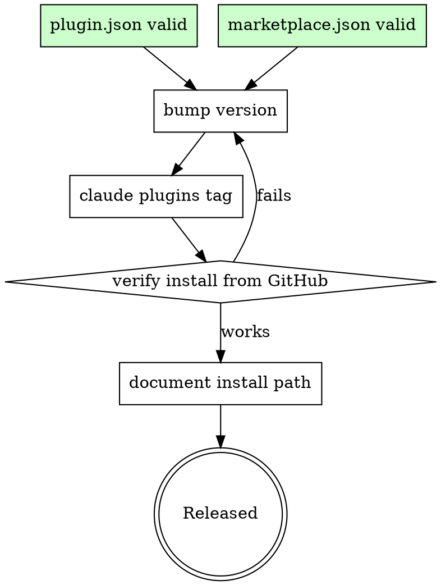
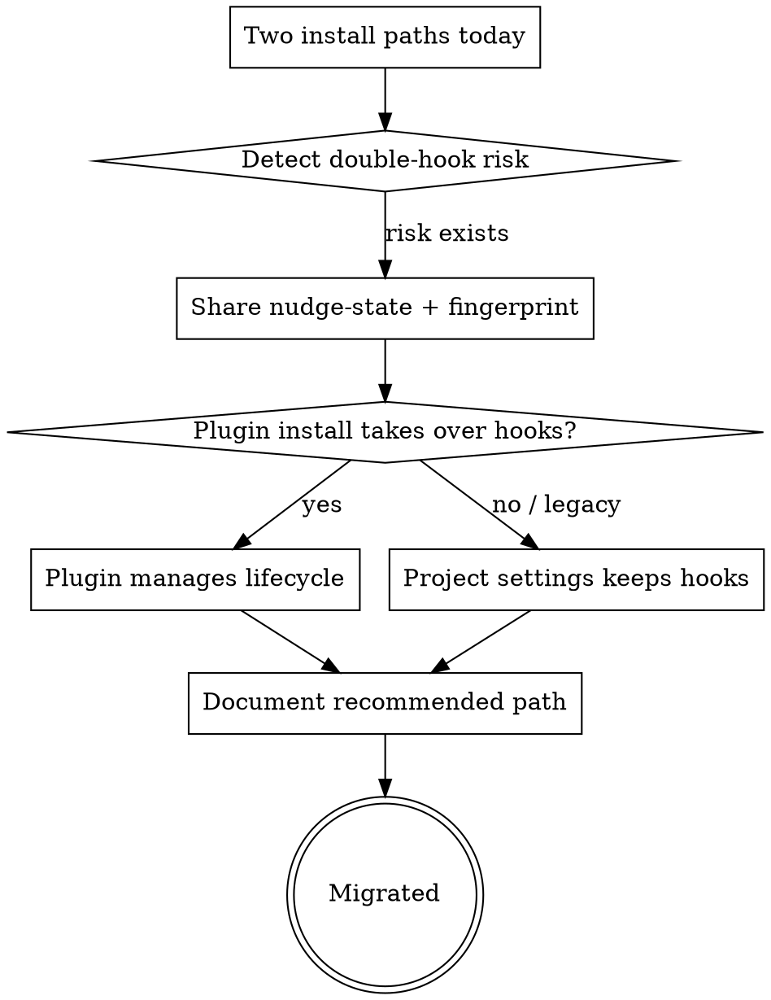

# SyberMem Backlog

> 已设计但暂缓推进的任务。需要时再启动。

## Deferred — 平台分发方向

这两个任务方向已验证可行，但当前优先级让位于"功能/设计本身的能力增强"，暂缓。

### 1. Marketplace 正式发布

**目标：** 让其他用户能通过 `claude plugins install sybermem@<marketplace>` 安装，而不是只能 `--plugin-dir .` 本地加载。

**已具备前置：**
- `.claude-plugin/plugin.json` 通过 `claude plugins validate`
- `.claude-plugin/marketplace.json` 通过 `claude plugins validate`（source 已修为 `./`）
- `scripts/check-plugin-package.py` 已集成真实 CLI 校验

**待做：**
- 用 `claude plugins tag` 打 `sybermem--v<version>` 发布 tag
- 验证 marketplace 从 GitHub repo 源可被发现和安装
- 文档化 marketplace 安装路径

**风险/注意：**
- `plugin.json.version` 必须随行为变更 bump，否则用户拿不到更新
- repo 根 `CLAUDE.md` 有一个 validate warning（不阻塞，但发布前可考虑迁移为 skill）

### 2. 安装入口迁移方案

**目标：** 把 plugin 安装设为默认推荐路径，脚本安装降级为兼容/legacy。

**当前状态：**
- README/INSTALL 已区分：插件安装（推荐）/ 脚本安装（兼容）/ OpenCode
- 但脚本安装仍是事实上的主路径（curl/irm one-liner）

**待做：**
- 设计 plugin 安装与脚本安装的并存/迁移策略
- 处理重复 hook 问题：plugin 的 Stop/SessionStart hook 与项目 `.claude/settings.json` 里的 hook 可能同时触发
- 决定是否让 plugin 安装时移除/接管项目本地 hook 配置
- 共享 `.sybermem/.nudge-state.json` 与 fingerprint，避免双路径重复 record/nudge

**风险/注意：**
- 双路径并存时最大风险是 Stop hook 跑两次 → 重复 auto trail
- 迁移必须非破坏性，保留已初始化项目的现有行为

---

## Deferred — 功能能力增强方向

### 3. C 组余下：Phase Hierarchy（阶段结构化）

**目标：** 让 phase 之间能表达依赖/演进/父子关系，不再是扁平 peer。

**触发条件：** 20+ phase 且需要回溯"哪个 phase 使能了哪个"时。

**待做：**
- phase-index 里加 `depends_on` / `parent` 字段
- summary 展示 phase 的前置/后续
- 未来 timeline/roadmap 视图

### 4. D 组：记录生命周期治理

**目标：** 给记录、topic、phase 加上状态管理和清理能力，防止记忆系统随时间变脏。

**触发条件：** 50+ 记录或跨多月使用，开始感到噪音（旧 topic 堆积、过时决策仍被引用、无法区分 active/completed phase）。

**待做：**
- 记录状态工作流：`proposed → approved → implemented → deprecated / superseded`
- Topic 衰减/合并：标记 deprecated topic、合并同义 topic
- Phase 完成标记：`active / completed / archived`

---

## Status

- Created: 2026-06-19
- Tasks 1-2 (marketplace + install migration): **deferred** — focus shifted to feature/design capability enhancement
- Tasks 3-4 (phase hierarchy + record lifecycle): **deferred** — v2 needs real-world usage before deciding priority
