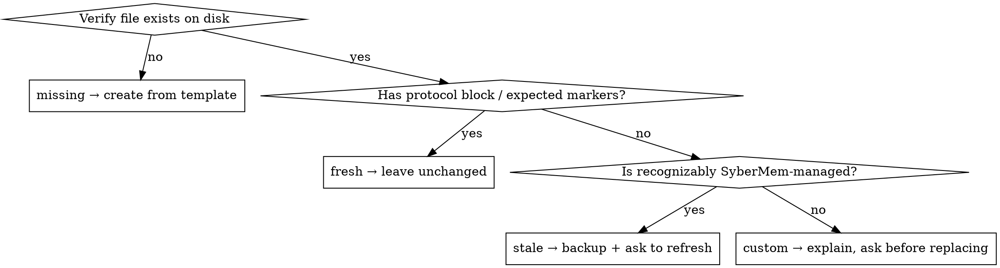

# File Classification Rules

This file contains the complete file classification logic, protocol-block handling rules, and non-destructive update rules for the `sybermem-init-project` skill.

## Step 1.1: Inspect project instruction files

Use these template files from this installed skill as the canonical refresh source:

- `project-files/AGENTS.md`
- `project-files/CLAUDE.md`
- `project-files/.claude/settings.json`
- `project-files/.sybermem/hooks/record_change_on_stop.py`
- `project-files/.sybermem/hooks/check_project_health.py`

**MANDATORY: Before classifying any file, you MUST verify its existence using a file-system tool. Do NOT infer existence from settings.json references, previous tool output, or conversation context. If the tool confirms the file does not exist, classify it as `missing` regardless of what other signals suggest.**

Classify each project file as one of:

- **missing** — file does not exist on disk (verified by file-system tool)
- **fresh** — file exists on disk and matches the current SyberMem-managed behavior set for this release, including the current analysis-aware command set and workflow guidance
- **stale SyberMem-managed** — file exists on disk and is recognizably SyberMem-managed, but is missing newly required behavior or wording for this release (for example pre-digest or pre-analysis managed content)
- **custom** — file exists on disk but no longer clearly behaves like a SyberMem-managed instruction file or template-derived file structure for this release.

Refresh rules:

1. **missing** → create it from the matching template file.
2. **fresh** → leave it unchanged.
3. **stale SyberMem-managed** → ask the user whether to refresh it. Before overwriting, create a same-directory backup such as `AGENTS.md.backup` or `CLAUDE.md.backup`, then replace it with the current template.
4. **custom** → do not overwrite automatically. Explain why it appears custom and ask before replacing it.

## Classification Decision Flowchart

## Protocol-block handling

For `CLAUDE.md` and `AGENTS.md`, treat the `using-sybermem` session-entry protocol as a marker-bounded managed block.

- If the file already contains `SYBERMEM_SESSION_PROTOCOL:START` and `SYBERMEM_SESSION_PROTOCOL:END`, refresh only the contents inside that block.
- If the file is still recognizably SyberMem-managed but does not yet contain the block, insert it near the top of the file.
- If the file is custom and does not contain the block, do not auto-insert it; explain the option and ask first.
- If the file is custom but already contains the markers, refresh only the block and leave the rest of the file unchanged.

This protocol block is the automatic entrypoint. The separately installed `/using-sybermem` skill is the visible manual entrypoint.

If the project was already initialized and only instruction files needed refresh, you may skip the codebase scan and go directly to the summary.

## Non-Destructive Update Rules

**These rules apply to ALL update operations, whether triggered by fast-path or full flow.**

| File | Allowed Update | Forbidden |
|---|---|---|
| `CLAUDE.md` / `AGENTS.md` | Insert or refresh the bounded `SYBERMEM_SESSION_PROTOCOL:START`/`END` block only. If the block exists, replace only its contents. If it does not exist, insert the complete block at the top of the file. All content outside the block markers is preserved verbatim. | Overwriting the entire file when it contains user content outside the protocol block. |
| `.claude/settings.json` | Read with `json.load`, add/update only SyberMem-owned keys (`env.SYBERMEM_RECORD_MODE`, `hooks.SessionStart`, `hooks.Stop`), write back with `json.dump`. All other keys, env vars, and hooks are preserved. | Overwriting the entire file from template. |
| `.sybermem/INDEX.md` | Insert missing sections (`## Phase Digests`, `## Topic Index`) at the appropriate position. All existing Key Conclusions, record tables, and user data are preserved. | Regenerating the entire file from template. |
| `.sybermem/hooks/*.py` | Full replacement from template — these are SyberMem-owned executables with no user content. | — |
| `.sybermem/templates/*.md` | Full replacement from template — these are SyberMem-owned templates. | — |
