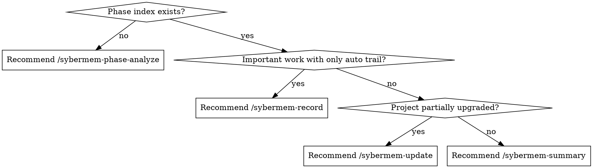

# using-sybermem Skill

**Announce at start:** "I'm using the using-sybermem skill to diagnose the current SyberMem state."

`using-sybermem` is the visible advisory entrypoint for the SyberMem system. It does not replace concrete skills like `record`, `summary`, `digest`, or `phase-analyze`. It reports the current project's SyberMem state and tells the user what the correct next command is.

<SUBAGENT-STOP>
If you were dispatched as a subagent to execute a specific task, skip this skill unless the task explicitly asks for SyberMem diagnostics.
</SUBAGENT-STOP>

## Quick guide (for humans)

> Plain-language overview for people. **Not** the execution contract — the
> `<HARD-GATE>`, `## Default orientation flow`, and the routing rules below are
> authoritative and win on any conflict.

**What it does:** a "where am I / what next" entrypoint. It checks the current
project's SyberMem state and tells you the single recommended next command — it
does not do the downstream work itself.

**When to run:** when you're unsure what to do next, or want a quick read on
whether the project is initialized, up to date, and what command fits now.

**What you get:** the resolved project root, a short state summary, and one
recommended next command with the reason — never a silent record/digest/analyze.

## Core Invariant

- **`using-sybermem` reports and routes; it does not silently perform downstream business actions.**

<HARD-GATE>
Do NOT auto-run `phase-analyze`, `record`, `summary`, or `digest` without telling the user.
Do NOT treat candidate phases as canonical.
Do NOT ignore the resolved root and answer from the wrong directory context.
</HARD-GATE>

## CLI Resolution

Before running SyberMem CLI commands, resolve a command variable first. On Windows PowerShell, prefer `$env:USERPROFILE\.claude\sybermem\cli\sybermem.cmd` and store the chosen command in `$SyberMemCli`; on Unix, prefer `$HOME/.claude/sybermem/cli/sybermem` and store the chosen command in `"$SYBERMEM_CLI"`. If the fixed launcher is unavailable, fall back to bare `sybermem`. Do not modify persistent PATH automatically. Command examples below use `$SyberMemCli` / `"$SYBERMEM_CLI"`.

## Default orientation flow

This is the normal path. It is four short steps and it never mutates anything.

### Step 1: Resolve the project root

Walk up from cwd to find `.sybermem/` + `.claude/settings.json` and report the
resolved **project root**. If no root resolves, say so and let Step 3 route.

### Step 2: Report a compact state summary

Report two high-level lines only — no implementation-level checklist here:

- **installation status** — is the SyberMem CLI reachable (fixed launcher or bare
  `sybermem`), and does the installed version match this project's recorded
  version (`$SyberMemCli doctor`)?
- **project status** — does `.sybermem/` exist with `INDEX.md`, `digests/`, and
  `analysis/phase-index.md` present?

If either line is unhealthy, or the CLI cannot be reached, continue to Step 3 and
then use `## Advanced diagnostics` to explain why.

### Step 3: Get the canonical recommendation

**Authoritative source: run the deterministic router, do not re-derive by hand.**

The canonical routing command is `sybermem next-step --format json`. Invoke it
through the resolved launcher — `$SyberMemCli next-step --format json` or
`"$SYBERMEM_CLI" next-step --format json` — and treat its `action` + `reason` as the
canonical recommendation. This is the same core router (`recommend_next_step`)
that `/sybermem-resume` uses, so `using-sybermem` and `resume` never disagree.
When no project root resolves, this route returns `/sybermem-init-project`
successfully — report that action rather than guessing.

Present the returned action verbatim, then add human-friendly context.

### Step 4: Present exactly one recommended command and stop

Report the single recommended command with its reason. **Do not run downstream actions**
such as `record`, `digest`, `theme-digest`, `phase-analyze`, `summary`, or
`update` as part of this skill — name the command and hand control back to the user.

## Advanced diagnostics

Use this section **only** when the CLI routing in Step 3 is unavailable, or when a
Step 2 health signal is unhealthy and the user needs to know why. These checks are
read-only; they diagnose and explain, they never repair.

### Manual health checks

- `.claude/settings.json` exists (if missing: root resolution will fail for all skills, stop hook will not trigger)
- `.sybermem/INDEX.md` contains all expected anchor comments — anchors
  `<!-- add new records here -->`, `<!-- add new conclusions here -->`, `<!-- add new digest records here -->`
- `.sybermem/analysis/phase-index.md` has `status:` field that is not `not_yet_analyzed` (if stale: phase-aware workflows will not work)
- project hooks under `.sybermem/hooks/` exist, in particular
  `.sybermem/hooks/record_change_on_stop.py` (if missing: auto-record mode is broken)
- no legacy protocol block remains in `CLAUDE.md` / `AGENTS.md` (a leftover legacy protocol
  block means init/update did not finish cleanly)

Report findings and name the command that would fix them (usually
`/sybermem-update` or `/sybermem-init-project`). Do not apply the fix here.

### Manual routing fallback

If the `sybermem` CLI is unavailable in this environment, and only then, fall
back to the decision graph below to derive an equivalent recommendation manually.
The graph documents the router's logic; it is not a second, competing source.

Priority order when several actions seem plausible:

```text
record > digest
```



Examples:
- if no phase index exists and the user wants phase-aware workflows → recommend `/sybermem-phase-analyze`
- if important work is happening and only a lightweight trail exists → recommend `/sybermem-record`
- if the current project has enough material but no digest → recommend `/sybermem-digest`
- if the project appears partially upgraded → recommend `/sybermem-update`

## Output Style

Return a short advisory report, for example:

```md
## SyberMem Status
- Project root: ...
- Installation: CLI reachable, version current / behind
- Project: index / digests / phase index present or missing

## Recommended next step
- <action> — <reason>
```

Only add an `## Advanced diagnostics` block to the report when the fallback or
manual health checks above were actually needed.

## Red Flags — STOP and Re-check

If you catch yourself doing any of these, STOP:
- Auto-running `phase-analyze`, `record`, `summary`, or `digest` without telling the user
- Walking the full manual health checklist before you have the `next-step` result
- Treating candidate phases as canonical
- Ignoring the resolved root and answering from the wrong directory context

## Terminal State

This skill is complete when:
- the resolved project root and a compact installation/project state have been reported
- the canonical `next-step` action has been presented with its reason
- exactly one recommended next command has been given, with no downstream action run

## Integration

**Related skills:**
- **sybermem-record** — Recommended when important work is happening
- **sybermem-phase-analyze** — Recommended when phase index is missing or stale
- **sybermem-summary** — Recommended for status overview
- **sybermem-update** — Recommended when project appears partially upgraded
