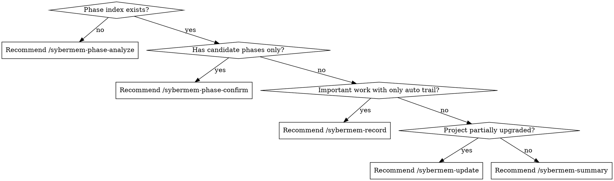

# using-sybermem Skill

**Announce at start:** "I'm using the using-sybermem skill to diagnose the current SyberMem state."

`using-sybermem` is the visible advisory entrypoint for the SyberMem system. It does not replace concrete skills like `record`, `summary`, `digest`, or `phase-analyze`. It reports the current project's SyberMem state and tells the user what the correct next command is.

<SUBAGENT-STOP>
If you were dispatched as a subagent to execute a specific task, skip this skill unless the task explicitly asks for SyberMem diagnostics.
</SUBAGENT-STOP>

## Core Invariant

- **`using-sybermem` reports and routes; it does not silently perform downstream business actions.**

<HARD-GATE>
Do NOT auto-run `phase-analyze`, `record`, `summary`, or `digest` without telling the user.
Do NOT treat candidate phases as canonical.
Do NOT ignore the resolved root and answer from the wrong directory context.
</HARD-GATE>

## Directory Resolution

Resolve project root by walking up from cwd to find `.sybermem/` + `.claude/settings.json`. Auto-migrate `ADR/` if found. Full rules in the session protocol block in AGENTS.md/CLAUDE.md.

## Flow

### Step 1: Health check and report current SyberMem state

First, run these diagnostic checks and flag any failures:
- `.claude/settings.json` exists (if missing: root resolution will fail for all skills, stop hook will not trigger)
- `.sybermem/INDEX.md` contains all expected anchor comments (`<!-- add new records here -->`, `<!-- add new conclusions here -->`, `<!-- add new digest records here -->`)
- `.sybermem/analysis/phase-index.md` has `status:` field that is not `not_yet_analyzed` (if stale: phase-aware workflows will not work)
- `.sybermem/hooks/record_change_on_stop.py` exists (if missing: auto-record mode is broken)

Then report:
- resolved project root
- whether `.sybermem/INDEX.md` exists
- whether `.sybermem/digests/` exists
- whether `.sybermem/analysis/phase-index.md` exists
- whether the `using-sybermem` session protocol block is present in instruction files when relevant

### Step 2: Report current routing behavior

Explain what would currently happen if the user runs:
- `/sybermem-summary`
- `/sybermem-digest`
- `/sybermem-phase-analyze`
- `/sybermem-record`
- `/sybermem-update`

### Step 3: Recommend the next command

Recommend the most appropriate next SyberMem command based on the current state.



Examples:
- if no phase index exists and the user wants phase-aware workflows → recommend `/sybermem-phase-analyze`
- if a candidate phase exists but no confirmed phase exists → recommend `/sybermem-phase-confirm`
- if important work is happening and only a lightweight trail exists → recommend `/sybermem-record`
- if the project appears partially upgraded → recommend `/sybermem-update`

## Output Style

Return a short advisory report, for example:

```md
## SyberMem Status
- Project root: ...
- Index: present / missing
- Digests: present / missing
- Phase index: present / missing

## Current routing
- summary: ...
- digest: ...
- analyze: ...
- record: ...
- update: ...

## Recommended next step
- ...
```

## Red Flags — STOP and Re-check

If you catch yourself doing any of these, STOP:
- Auto-running `phase-analyze`, `record`, `summary`, or `digest` without telling the user
- Treating candidate phases as canonical
- Ignoring the resolved root and answering from the wrong directory context

## Terminal State

This skill is complete when:
- the current SyberMem state has been reported
- the routing implications for the main SyberMem commands have been explained
- a recommended next command has been given

## Integration

**Related skills:**
- **sybermem-record** — Recommended when important work is happening
- **sybermem-phase-analyze** — Recommended when phase index is missing or stale
- **sybermem-phase-confirm** — Recommended when candidate phases need confirmation
- **sybermem-summary** — Recommended for status overview
- **sybermem-update** — Recommended when project appears partially upgraded
