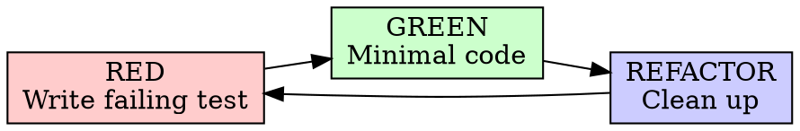

# Superpowers Skill 系统设计全面分析

> **版本**: 基于 Superpowers v6.0.2 分析
> **作者**: Jesse Vincent / Prime Radiant
> **仓库**: https://github.com/obra/superpowers
> **定位**: 编码 Agent 的完整软件开发方法论 — 跨平台（Claude Code / Codex / Gemini CLI / Copilot / Cursor / Pi 等）

---

## 目录

1. [整体架构](#1-整体架构)
2. [Plugin 框架层](#2-plugin-框架层)
3. [Skill 文件规范](#3-skill-文件规范)
4. [语义组织与分类体系](#4-语义组织与分类体系)
5. [核心设计模式](#5-核心设计模式)
6. [Skill 间的协作拓扑](#6-skill-间的协作拓扑)
7. [行为塑造技术](#7-行为塑造技术)
8. [跨平台适配策略](#8-跨平台适配策略)
9. [引导与注入体系](#9-引导与注入体系)
10. [设计原则总结](#10-设计原则总结)
11. [为你的 Skill 提供的设计清单](#11-为你的-skill-提供的设计清单)

---

## 1. 整体架构

### 1.1 三层架构

```
┌─────────────────────────────────────────────────────┐
│  Marketplace Layer (发现与分发)                      │
│  marketplace.json → 插件目录、版本、来源 URL          │
├─────────────────────────────────────────────────────┤
│  Plugin Layer (生命周期管理)                          │
│  plugin.json + hooks.json + package.json             │
│  SessionStart hook → 引导注入 using-superpowers      │
├─────────────────────────────────────────────────────┤
│  Skill Layer (行为塑造内容)                           │
│  skills/<name>/SKILL.md + 辅助文件                   │
│  YAML frontmatter → 发现 | Markdown body → 执行      │
└─────────────────────────────────────────────────────┘
```

### 1.2 目录结构

```
superpowers/
├── .claude-plugin/
│   ├── plugin.json           # 插件元数据（名称、版本、描述、关键词）
│   └── marketplace.json      # marketplace 注册信息
├── .codex-plugin/plugin.json # Codex 平台适配
├── .cursor-plugin/plugin.json# Cursor 平台适配
├── .kimi-plugin/plugin.json  # Kimi Code 平台适配
├── gemini-extension.json     # Gemini CLI 扩展描述
├── .pi/extensions/           # Pi 平台扩展
├── .opencode/                # OpenCode 安装指南
├── hooks/
│   ├── hooks.json            # Claude Code hooks 定义
│   ├── hooks-codex.json      # Codex hooks
│   ├── hooks-cursor.json     # Cursor hooks
│   └── run-hook.cmd/.sh      # hook 执行脚本（跨平台）
├── skills/                   # ⭐ 核心 skill 目录（扁平命名空间）
│   ├── using-superpowers/    # Bootstrap skill（入口）
│   │   ├── SKILL.md
│   │   └── references/       # 各平台工具映射文档
│   │       ├── claude-code-tools.md
│   │       ├── codex-tools.md
│   │       ├── gemini-tools.md
│   │       ├── copilot-tools.md
│   │       ├── pi-tools.md
│   │       └── antigravity-tools.md
│   ├── brainstorming/
│   │   ├── SKILL.md
│   │   ├── visual-companion.md
│   │   └── spec-document-reviewer-prompt.md
│   ├── writing-plans/
│   │   ├── SKILL.md
│   │   └── plan-document-reviewer-prompt.md
│   ├── subagent-driven-development/
│   │   ├── SKILL.md
│   │   ├── implementer-prompt.md      # 子 Agent prompt 模板
│   │   ├── task-reviewer-prompt.md    # 任务审查 prompt 模板
│   │   └── scripts/                   # review-package, task-brief 等
│   ├── test-driven-development/
│   │   ├── SKILL.md
│   │   └── testing-anti-patterns.md
│   ├── systematic-debugging/
│   │   ├── SKILL.md
│   │   ├── root-cause-tracing.md      # 辅助技术
│   │   ├── defense-in-depth.md
│   │   └── condition-based-waiting.md
│   ├── verification-before-completion/
│   │   └── SKILL.md                   # 自包含
│   ├── dispatching-parallel-agents/
│   │   └── SKILL.md                   # 自包含
│   ├── executing-plans/
│   │   └── SKILL.md                   # 自包含
│   ├── requesting-code-review/
│   │   ├── SKILL.md
│   │   └── code-reviewer.md           # 审查员 prompt 模板
│   ├── receiving-code-review/
│   │   └── SKILL.md
│   ├── using-git-worktrees/
│   │   └── SKILL.md
│   ├── finishing-a-development-branch/
│   │   └── SKILL.md
│   └── writing-skills/
│       ├── SKILL.md
│       ├── anthropic-best-practices.md
│       ├── persuasion-principles.md
│       ├── testing-skills-with-subagents.md
│       └── examples/
├── CLAUDE.md                 # Claude Code 指令（指向 SKILL.md）
├── AGENTS.md                 # 通用 Agent 指令（指向 CLAUDE.md）
├── GEMINI.md                 # Gemini: @ 引用 skill 文件
├── docs/                     # 设计文档、计划文档
├── tests/                    # 插件基础设施测试
└── package.json              # Pi 包元数据
```

### 1.3 关键设计决策

| 决策 | 选择 | 理由 |
|------|------|------|
| Skill 存储格式 | Markdown + YAML frontmatter | 人类可读、Agent 原生理解、无需解析器 |
| 目录结构 | 扁平命名空间 `skills/<name>/` | 一级可搜索，无嵌套层级 |
| 平台适配 | 多套入口文件 + references 映射 | 同一 skill 内容，不同平台入口 |
| 依赖策略 | 零外部依赖 | 任何环境可用，无安装障碍 |
| Hook 机制 | SessionStart 注入 bootstrap | 确保 skill 在每次会话自动生效 |

---

## 2. Plugin 框架层

### 2.1 plugin.json — 插件元数据

```json
{
  "name": "superpowers",
  "description": "Core skills library for Claude Code: TDD, debugging...",
  "version": "6.0.2",
  "author": { "name": "Jesse Vincent", "email": "jesse@fsck.com" },
  "homepage": "https://github.com/obra/superpowers",
  "license": "MIT",
  "keywords": ["skills", "tdd", "debugging", "collaboration", "workflows"]
}
```

**要点**：
- `keywords` 用于 marketplace 搜索发现
- `version` 遵循 semver，支持自动更新检测
- `strict: true` 在 marketplace.json 中启用严格模式

### 2.2 hooks.json — 生命周期钩子

```json
{
  "hooks": {
    "SessionStart": [{
      "matcher": "startup|clear|compact",
      "hooks": [{
        "type": "command",
        "command": "\"${CLAUDE_PLUGIN_ROOT}/hooks/run-hook.cmd\" session-start",
        "async": false
      }]
    }]
  }
}
```

**关键机制**：
- `SessionStart` 在会话启动、clear、compact 时触发
- 注入 `using-superpowers` bootstrap skill 到系统提示
- `async: false` 确保在 Agent 响应前完成注入
- 不同平台有各自的 hooks 文件（hooks-codex.json、hooks-cursor.json）

### 2.3 多平台入口文件

| 平台 | 入口文件 | 加载方式 |
|------|----------|----------|
| Claude Code | CLAUDE.md → hooks.json | SessionStart hook 注入 |
| Codex | hooks-codex.json | 原生 hook |
| Gemini CLI | GEMINI.md | `@` 引用直接加载 SKILL.md |
| Cursor | hooks-cursor.json | 原生 hook |
| Copilot CLI | marketplace 注册 | plugin 安装 |
| Pi | package.json + .pi/extensions/ | 原生扩展 |
| OpenCode | .opencode/INSTALL.md | 手动安装指引 |

---

## 3. Skill 文件规范

### 3.1 SKILL.md 标准结构

每个 skill 的核心是一个 `SKILL.md` 文件，遵循统一结构模板：

```markdown
---
name: skill-name-with-hyphens
description: Use when [specific triggering conditions] - [symptoms/situations]
---

# Skill Name

## Overview
[核心原则，1-2句话。"Core principle: ..."]

## When to Use
[触发条件、适用场景、不适用场景]
[可选: Graphviz 决策流程图]

## The Iron Law（纪律性 skill 专用）
[不可违反的核心规则，用代码块强调]

## The Process / Checklist
[步骤、检查清单，使用 checkbox 语法]
[可选: Graphviz 流程图]

## Red Flags（纪律性 skill 专用）
[违规信号列表 — "如果你发现自己在想…"]

## Common Rationalizations（纪律性 skill 专用）
[| Excuse | Reality | 表格 — 反驳合理化借口]

## Common Mistakes
[常见错误及修复]

## Quick Reference
[表格或要点速查]

## Integration
[与其他 skill 的关联: REQUIRED SUB-SKILL / REQUIRED BACKGROUND]

## Real-World Impact (可选)
[实际数据/案例]
```

### 3.2 Frontmatter 规范详解

```yaml
---
name: skill-name-with-hyphens        # 必须: 字母+数字+连字符，无特殊字符
description: Use when [条件] - [描述]  # 必须: <500 字符，第三人称
---
```

**规则总结**：

| 规则 | 说明 |
|------|------|
| 以 "Use when..." 开头 | 聚焦于触发条件，不描述技能做什么 |
| **禁止描述工作流** | 实测证明 Agent 会把 description 当完整指令、跳过正文 |
| 第三人称 | 会被注入到系统提示中，不是对话 |
| <500 字符 | 节省 token，提高发现效率 |
| <1024 字符总 frontmatter | agentskills.io 规范硬限制 |

**正反对比**：

```yaml
# ❌ 描述工作流 → Agent 会跳过正文，只读 description
description: Use when executing plans - dispatches subagent per task with code review between tasks

# ❌ 太抽象 → Agent 无法匹配触发条件
description: For async testing

# ❌ 第一人称 → 被注入系统提示后语气不自然
description: I can help you with async tests when they're flaky

# ✅ 只描述触发条件
description: Use when executing implementation plans with independent tasks in the current session

# ✅ 包含具体症状/场景
description: Use when encountering any bug, test failure, or unexpected behavior, before proposing fixes

# ✅ 包含时机提示
description: Use when about to claim work is complete, fixed, or passing, before committing or creating PRs
```

> **这是 Superpowers 最重要的经验教训**：description 里写了工作流摘要后，Agent 在一次测试中只做了一次 code review，尽管 SKILL.md 正文里的流程图清楚地要求两次（spec compliance + code quality）。去掉工作流摘要后，Agent 正确地读了流程图并执行了两次审查。

### 3.3 辅助文件组织原则

| 模式 | 目录结构 | 适用场景 |
|------|----------|----------|
| **自包含** | `skill-name/SKILL.md` | 全部内容内联即可 |
| **带参考资料** | `skill-name/SKILL.md` + `*.md` | 参考材料 >100 行 |
| **带 Prompt 模板** | `skill-name/SKILL.md` + `*-prompt.md` | 需要子 Agent 分发模板 |
| **带脚本工具** | `skill-name/SKILL.md` + `scripts/` | 有可执行的辅助脚本 |

**分离判断**：
- **100+ 行的参考资料** → 独立文件
- **可复用脚本/工具** → 独立文件或 scripts/ 目录
- **Prompt 模板** → 独立 .md 文件（如 `implementer-prompt.md`）
- **原则、概念、<50 行代码** → 内联在 SKILL.md

---

## 4. 语义组织与分类体系

### 4.1 四大分类

```
┌──────────────────────────────────────────┐
│            Testing（测试）                │
│  test-driven-development                 │
├──────────────────────────────────────────┤
│           Debugging（调试）               │
│  systematic-debugging                    │
│  verification-before-completion          │
├──────────────────────────────────────────┤
│         Collaboration（协作）             │
│  brainstorming                           │
│  writing-plans                           │
│  executing-plans                         │
│  subagent-driven-development             │
│  dispatching-parallel-agents             │
│  requesting-code-review                  │
│  receiving-code-review                   │
│  using-git-worktrees                     │
│  finishing-a-development-branch          │
├──────────────────────────────────────────┤
│            Meta（元技能）                 │
│  writing-skills                          │
│  using-superpowers                       │
└──────────────────────────────────────────┘
```

### 4.2 按约束力度分类

| 类型 | 特征 | 代表 Skill |
|------|------|------------|
| **Rigid（刚性）** | 必须严格遵循，不允许适应性偏离 | TDD, systematic-debugging, verification-before-completion |
| **Flexible（柔性）** | 原则适应上下文 | dispatching-parallel-agents, brainstorming |

Skill 自身会声明属于哪种类型。

### 4.3 按功能角色分类

| 角色 | Skill | 职责 |
|------|-------|------|
| **Bootstrap** | using-superpowers | 会话入口，教 Agent 发现和使用 skill |
| **Process** | brainstorming, systematic-debugging | 决定"如何"处理任务（最高优先级） |
| **Planning** | writing-plans | 将设计转化为可执行计划 |
| **Execution** | executing-plans, subagent-driven-development | 执行计划 |
| **Quality** | TDD, verification, code-review × 2 | 确保质量 |
| **Infrastructure** | using-git-worktrees, dispatching-parallel-agents | 工作空间和并发 |
| **Lifecycle** | finishing-a-development-branch | 完成和清理 |
| **Meta** | writing-skills | 创造新的 skill |

**优先级规则**：Process skills 先于 Implementation skills。
- "Let's build X" → brainstorming first
- "Fix this bug" → systematic-debugging first

---

## 5. 核心设计模式

### 5.1 The Iron Law 模式

几乎每个 Rigid skill 都有一个不可违反的铁律，使用**代码块**强调：

```
NO PRODUCTION CODE WITHOUT A FAILING TEST FIRST
```
```
NO FIXES WITHOUT ROOT CAUSE INVESTIGATION FIRST
```
```
NO COMPLETION CLAIMS WITHOUT FRESH VERIFICATION EVIDENCE
```

**设计意图**：代码块在视觉上突出，Agent 更不容易跳过。措辞简短、绝对、无例外。

紧跟铁律之后通常有一句：

> **Violating the letter of the rules is violating the spirit of the rules.**

这句话封堵"我在遵循精神"的逃避路径。

### 5.2 Red Flags 模式

每个纪律性 skill 包含一个红旗列表——Agent 自检机制：

```markdown
## Red Flags - STOP and Start Over

- Code before test
- Test after implementation
- Test passes immediately
- "I already manually tested it"
- "Tests after achieve the same purpose"
- "This is different because..."

**All of these mean: Delete code. Start over with TDD.**
```

**设计意图**：Agent 在产生违规思维时能自我识别并中断。列表条目混合了**行为**（code before test）和**思维**（"I already manually tested it"），覆盖两种违规路径。

### 5.3 Rationalization Table 模式

```markdown
| Excuse | Reality |
|--------|---------|
| "Too simple to test" | Simple code breaks. Test takes 30 seconds. |
| "I'll test after" | Tests passing immediately prove nothing. |
| "TDD is dogmatic, being pragmatic" | TDD IS pragmatic. |
| "Deleting X hours is wasteful" | Sunk cost fallacy. |
```

**设计意图**：
- 预先枚举 Agent 可能的"合理化借口"并提供反驳
- 每条反驳都简短有力，不是说教
- **来自实际压力测试，不是凭空编造**

### 5.4 Graphviz 决策流程图

Superpowers 大量使用 `dot` 语法的内联 Graphviz 图：



**使用原则**：
- ✅ **仅用于** 非显而易见的决策点、可能过早终止的流程循环、A vs B 选择
- ❌ **不用于** 参考资料（用表格）、代码示例（用代码块）、线性步骤（用编号列表）、无语义的标签（step1, helper2）

### 5.5 Checklist + Todo 绑定模式

```markdown
## Checklist

You MUST create a task for each of these items and complete them in order:

1. **Explore project context** — check files, docs, recent commits
2. **Ask clarifying questions** — one at a time
3. **Propose 2-3 approaches** — with trade-offs
4. **Present design** — in sections, get approval
5. **Write design doc** — save and commit
6. **Spec self-review** — check for issues
7. **User reviews written spec**
8. **Transition to implementation** — invoke writing-plans
```

**设计意图**：强制创建 todo item 跟踪进度，确保不跳步。Checklist 与 Agent 的任务系统绑定。

### 5.6 Good/Bad 对比模式

```markdown
<Good>
```typescript
test('retries failed operations 3 times', async () => {
  // Clear name, tests real behavior, one thing
});
```
Clear name, tests real behavior, one thing
</Good>

<Bad>
```typescript
test('retry works', async () => {
  // Vague name, tests mock not code
});
```
Vague name, tests mock not code
</Bad>
```

**设计意图**：用 `<Good>` / `<Bad>` 标签让 Agent 快速区分正反模式。标签后附带简短解释。

### 5.7 Quick Reference 表格模式

每个 skill 的末尾通常有速查表：

```markdown
| Phase | Key Activities | Success Criteria |
|-------|---------------|------------------|
| 1. Root Cause | Read errors, reproduce | Understand WHAT and WHY |
| 2. Pattern | Find working examples | Identify differences |
| 3. Hypothesis | Form theory, test minimally | Confirmed or new hypothesis |
| 4. Implementation | Create test, fix, verify | Bug resolved, tests pass |
```

**设计意图**：Agent 执行时可以快速回看当前阶段应做什么，无需重读全文。

### 5.8 "Human Partner" 术语

Superpowers **刻意使用 "your human partner"** 而非 "the user"：

> *"your human partner" is deliberate, not interchangeable with "the user"*

**设计意图**：强化 Agent 与人类之间的协作关系，暗示 Agent 有责任保护人类合作者（例如阻止提交低质量 PR）。

---

## 6. Skill 间的协作拓扑

### 6.1 主工作流链

```
using-superpowers (Bootstrap / 入口)
        │
        ▼
  brainstorming (设计探索)
        │ 唯一出口
        ▼
  writing-plans (实施计划)
        │
        ├──────────────────────────┐
        ▼                          ▼
subagent-driven-            executing-plans
development (推荐)          (备选/无子Agent时)
        │                          │
        │  每任务后                  │
        ▼                          │
requesting-code-review             │
        │                          │
        ▼                          ▼
finishing-a-development-branch (收尾)
```

### 6.2 完整引用关系图

```
using-superpowers ─────────────────────► 所有 skill（Bootstrap，决定调用优先级）

brainstorming ──── 唯一出口 ──────────► writing-plans
                                        （HARD-GATE: 设计未批准前禁止任何实现）

writing-plans ──── 选择 ──────────────► subagent-driven-development（推荐）
              └─── 选择 ──────────────► executing-plans（备选）

subagent-driven-development
    ├── REQUIRED ─────────────────────► requesting-code-review（每任务后）
    ├── 子 Agent 使用 ─────────────────► test-driven-development
    ├── REQUIRED ─────────────────────► finishing-a-development-branch（全部完成后）
    └── 前置 ─────────────────────────► using-git-worktrees

executing-plans
    ├── REQUIRED ─────────────────────► finishing-a-development-branch
    └── 前置 ─────────────────────────► using-git-worktrees

systematic-debugging
    ├── 相关 ─────────────────────────► test-driven-development（Phase 4 写测试）
    └── 相关 ─────────────────────────► verification-before-completion

writing-skills
    └── REQUIRED BACKGROUND ──────────► test-driven-development
```

### 6.3 Cross-Reference 语法规范

```markdown
# ✅ 正确：使用 skill 名称 + REQUIRED 标记
**REQUIRED SUB-SKILL:** Use superpowers:subagent-driven-development
**REQUIRED BACKGROUND:** You MUST understand superpowers:test-driven-development

# ✅ 正确：相关引用（非强制）
**Related skills:**
- **superpowers:test-driven-development** - For creating failing test case

# ❌ 错误：使用文件路径（不清楚是否必须）
See skills/testing/test-driven-development

# ❌ 错误：@ 链接（强制加载，浪费 200k+ context）
@skills/testing/test-driven-development/SKILL.md
```

---

## 7. 行为塑造技术

### 7.1 强制执行层级（由弱到强）

```
Level 1: 建议（Flexible skill 中的指导）
         "Prefer...", "Consider..."
         ↓
Level 2: 规则（Rigid skill 正文中的步骤和要求）
         明确的步骤、When to Use / Don't use when
         ↓
Level 3: 铁律（The Iron Law）
         "NO X WITHOUT Y FIRST" — 代码块，绝对禁止
         ↓
Level 4: 精神条款
         "Violating the letter is violating the spirit"
         封堵"我在遵循精神"的逃避
         ↓
Level 5: 红旗自检
         "If you catch yourself thinking..." — 内在触发器
         ↓
Level 6: 合理化反驳表
         每个借口都有预备好的反驳，来自真实压力测试
```

### 7.2 XML 行为标签体系

| 标签 | 用途 | 位置 |
|------|------|------|
| `<EXTREMELY-IMPORTANT>` | 最高优先级行为约束 | Bootstrap 中 "1% 可能就必须调用 skill" |
| `<HARD-GATE>` | 流程中的硬门控 | Brainstorming 的 "设计未批准不许写代码" |
| `<SUBAGENT-STOP>` | 阻止子 Agent 递归触发 | Bootstrap 的 "子 Agent 跳过此 skill" |
| `<Good>` / `<Bad>` | 正反模式对比 | TDD 的测试用例对比 |

### 7.3 文本格式强调体系

| 格式 | 用途 | 示例 |
|------|------|------|
| ```` ``` ```` 代码块 | Iron Law，绝对不可违反的规则 | `NO X WITHOUT Y FIRST` |
| `**REQUIRED SUB-SKILL:**` | 强制引用其他 skill | 计划执行后必须使用 SDD |
| `**REQUIRED BACKGROUND:**` | 前置知识要求 | writing-skills 要求先懂 TDD |
| `**Announce at start:**` | Skill 启动时的宣告 | "I'm using the xxx skill to..." |
| `**NEVER:**` / `**Always:**` | 绝对禁止/必须 | Red Flags 下方的行为清单 |

### 7.4 Match the Form to the Failure（形式匹配失败类型）

这是 Superpowers `writing-skills` 中总结的**关键发现**——不同失败需要不同形式的指导：

| 基线失败类型 | 正确形式 | 错误形式 |
|-------------|----------|----------|
| 在压力下跳过/违反规则（知道却做不到） | 禁止 + 合理化表 + 红旗 | 软性指导 "prefer..." |
| 遵守了但输出形状错误 | **正面菜谱**：描述输出应该是什么样 | 禁止列表 "don't X" |
| 缺少必需元素 | 模板中的 **REQUIRED 字段** | 散文提醒 |
| 行为应随条件变化 | 基于**可观察谓词**的条件 | 无条件规则 + 豁免条款 |

**关键发现**：
> 禁止性指导在"输出塑造"问题上**反向生效**——在对照测试中，带有 "don't X" 指导的 Agent 反而产出**更多**被禁止的内容，甚至比无指导的对照组还差。原因：在竞争激励（"make the prompt self-contained"）下，Agent 会与 "don't X" 谈判。而正面菜谱不给谈判空间：输出要么匹配规定形状，要么不匹配。

**附加规则**：
- **No nuance clauses**："Don't X unless it matters" 重新打开谈判。测试中仅添加一条"除非重要"的修饰就将获胜的菜谱降级为噪声。
- **Exemption clauses don't scope**："This limit doesn't apply to code blocks" 仍然会抑制代码块的产出。

### 7.5 Skill Discovery Optimization (SDO)

核心洞察再次强调：**Description 必须只描述"何时使用"，绝不描述"怎么使用"**。

补充的 SDO 技术：

**关键词覆盖**：
```
- 错误信息: "Hook timed out", "ENOTEMPTY", "race condition"
- 症状: "flaky", "hanging", "zombie", "pollution"
- 同义词: "timeout/hang/freeze", "cleanup/teardown/afterEach"
- 工具: 实际命令、库名、文件类型
```

**命名约定**：
```
✅ 动词优先，主动语态
   condition-based-waiting    (不是 async-test-helpers)
   root-cause-tracing         (不是 debugging-techniques)

✅ 动名词(-ing)适合流程类
   creating-skills, testing-skills, debugging-with-logs
```

---

## 8. 跨平台适配策略

### 8.1 平台抽象原则

Skill 内容**使用动作描述，不命名特定工具**：

```markdown
# ✅ 平台无关的动作描述
"dispatch a subagent"
"create a todo"
"read a file"

# ❌ 特定平台的工具名称
"use the Agent tool"
"call TaskCreate"
"invoke Skill('brainstorming')"
```

### 8.2 References 映射层

`using-superpowers/references/` 目录包含每个平台的工具映射文档：

```
references/
├── claude-code-tools.md    # "dispatch subagent" → Agent tool
├── codex-tools.md          # "dispatch subagent" → codex_agent
├── copilot-tools.md
├── gemini-tools.md         # "dispatch subagent" → run_agent
├── pi-tools.md
└── antigravity-tools.md
```

Agent 在需要时查阅对应平台的映射文件，将抽象动作翻译为平台工具调用。

### 8.3 入口注入策略对比

| 平台 | 文件 | 机制 | 特点 |
|------|------|------|------|
| Claude Code | hooks.json | SessionStart hook 运行脚本 → 注入 bootstrap | 最成熟，异步=false |
| Gemini CLI | GEMINI.md | `@` 引用直接内联加载 | 简单直接 |
| Codex | hooks-codex.json | 原生 hook 事件 | 平台原生支持 |
| Pi | package.json | extensions/ 中 TS 扩展注入 | 编程方式注入 |
| Cursor | hooks-cursor.json | 原生 hook | 类似 Claude Code |

### 8.4 优先级体系

```
1. 用户显式指令 (CLAUDE.md / GEMINI.md / AGENTS.md / 直接请求)  — 最高
2. Superpowers skills — 覆盖默认系统行为
3. 默认系统提示 — 最低
```

> 如果 CLAUDE.md 说"不使用 TDD"而 skill 说"总是使用 TDD"，遵循用户指令。

---

## 9. 引导与注入体系

### 9.1 Bootstrap 完整流程

```
SessionStart hook 触发（会话启动 / clear / compact）
    │
    ▼
run-hook.cmd 执行 → 注入 using-superpowers/SKILL.md 到系统提示
    │
    ▼
Agent 在系统提示中看到：
  - using-superpowers 全文（bootstrap 指令）
  - 所有已安装 skill 的列表（名称 + description）
    │
    ▼
用户发送消息
    │
    ▼
Agent 检查："是否有 skill 适用？（即使只有 1% 可能性也要检查）"
    │
    ├── 适用 → 通过 Skill tool 加载 SKILL.md → 读取全文 → 严格执行
    │         └── 宣布: "Using [skill] to [purpose]"
    │         └── 有 Checklist? → 为每项创建 todo
    │
    └── 不适用 → 正常响应（包括澄清性问题）
```

### 9.2 指令文件链

```
CLAUDE.md ← AGENTS.md（指向 CLAUDE.md）
    │
    ▼
hooks.json → SessionStart → 注入 using-superpowers
    │
    ▼
GEMINI.md → @using-superpowers/SKILL.md + @references/gemini-tools.md
```

### 9.3 文档存放约定

| 文档类型 | 路径 | 生成时机 |
|----------|------|----------|
| 设计文档 (Spec) | `docs/superpowers/specs/YYYY-MM-DD-<topic>-design.md` | brainstorming 完成后 |
| 实施计划 (Plan) | `docs/superpowers/plans/YYYY-MM-DD-<feature>.md` | writing-plans 完成后 |
| 进度账本 (Ledger) | `$(git rev-parse --git-path sdd)/progress.md` | SDD 执行时持续更新 |
| Review Package | scripts/review-package 输出 | 每次任务 review 前生成 |

---

## 10. 设计原则总结

### 10.1 核心哲学

| 原则 | 体现 |
|------|------|
| **Test-Driven** | 代码先写测试；Skill 先写压力场景（RED-GREEN-REFACTOR） |
| **Systematic over Ad-hoc** | 流程优于猜测；Iron Law 禁止无调查的修复 |
| **Evidence over Claims** | verification-before-completion: 验证后才能声明完成 |
| **YAGNI** | 不需要就不做；brainstorming 中"ruthlessly remove" |
| **DRY** | 不重复；cross-reference 替代复制 |
| **Complexity Reduction** | 简单是首要目标；小文件、清晰接口 |

### 10.2 Skill 设计十大戒律

1. **Description 只写"何时使用"** — 绝不总结工作流（SDO 铁律）
2. **纪律性 skill 必须有 Iron Law** — 代码块、绝对、无例外
3. **Red Flags 是自检机制** — 混合行为和思维两种触发
4. **Rationalization Table 来自实际测试** — 不是凭空编造
5. **形式匹配失败类型** — 禁止 vs 菜谱 vs 模板字段 vs 条件谓词
6. **Flowchart 只用于决策点** — 不是装饰或线性步骤
7. **Cross-reference 用 skill 名称** — 不用文件路径或 @ 链接
8. **平台抽象用动作描述** — 不指名特定工具
9. **辅助文件仅用于大量参考或可复用工具** — 其余内联
10. **"your human partner" 不是 "the user"** — 术语塑造关系

### 10.3 Token 经济学

| Skill 类型 | 目标词数 |
|------------|----------|
| Bootstrap / 频繁加载 | <150-200 词 |
| 普通 skill | <500 词 |
| 大量参考资料 | 拆分到独立文件，按需加载 |

**节省 token 的技巧**：
- 用 `--help` 替代在 skill 中列举所有 CLI 选项
- 用 cross-reference 替代重复其他 skill 的内容
- 压缩示例（最小化叙述，保留核心模式）
- 一个优秀示例胜过多个平庸示例

---

## 11. 为你的 Skill 提供的设计清单

### 11.1 SKILL.md 快速模板

```markdown
---
name: your-skill-name
description: Use when [具体触发条件] - [症状/情境描述]
---

# Your Skill Name

## Overview

[1-2 句话说明是什么]

**Core principle:** [一句话核心原则]

**Violating the letter of this process is violating the spirit.** (纪律性 skill 用)

## When to Use

**Use for:**
- [场景 1]
- [场景 2]

**Don't use when:**
- [排除场景]

## The Iron Law (纪律性 skill)

\```
NO X WITHOUT Y FIRST
\```

## The Process / Checklist

You MUST create a task for each item:

1. **[步骤名]** — [描述]
2. **[步骤名]** — [描述]
...

## Red Flags - STOP (纪律性 skill)

- [违规思维/行为 1]
- [违规思维/行为 2]
- "引用 Agent 可能的内心独白"

**All of these mean: STOP. [应对行动].**

## Common Rationalizations (纪律性 skill)

| Excuse | Reality |
|--------|---------|
| "[借口1]" | [简短有力的反驳] |
| "[借口2]" | [简短有力的反驳] |

## Quick Reference

| Situation | Action |
|-----------|--------|
| [情况] | [行动] |

## Common Mistakes

| Mistake | Fix |
|---------|-----|
| [错误] | [修复] |

## Integration

**Required workflow skills:**
- **superpowers:xxx** - [职责]

**Related skills:**
- **superpowers:yyy** - [关联]
```

### 11.2 完整设计检查清单

**Frontmatter**
- [ ] `name` 只用字母 + 数字 + 连字符？
- [ ] `description` 以 "Use when..." 开头？
- [ ] `description` < 500 字符？
- [ ] `description` **不描述工作流**，只描述触发条件？
- [ ] `description` 使用第三人称？

**结构**
- [ ] 遵循标准结构：Overview → When → (Iron Law) → Process → (Red Flags) → (Rationalizations) → Quick Reference → Integration？
- [ ] Overview 有 "Core principle:" 一句话？
- [ ] When to Use 同时包含适用和不适用场景？

**纪律性 Skill 专用**
- [ ] 有 Iron Law（代码块、绝对语气）？
- [ ] 有 "Violating the letter is violating the spirit" 精神条款？
- [ ] 有 Red Flags 自检列表？混合行为和思维模式？
- [ ] 有 Rationalization Table？每条来自实际测试？
- [ ] 形式匹配失败类型？（禁止 vs 菜谱 vs 模板 vs 条件）

**流程图**
- [ ] 只用在决策点和循环流程？
- [ ] 不用于线性步骤或参考资料？
- [ ] 节点标签有语义含义（不是 step1, step2）？

**引用与集成**
- [ ] Cross-reference 用 `**REQUIRED SUB-SKILL:**` + skill 名称？
- [ ] 不使用文件路径或 `@` 链接？
- [ ] 有 Integration 部分列出必需和相关 skill？

**文件组织**
- [ ] 大量参考（>100 行）→ 独立文件？
- [ ] 可复用脚本 → scripts/ 目录或独立文件？
- [ ] Prompt 模板 → 独立 `*-prompt.md` 文件？
- [ ] 原则、概念、<50 行代码 → 内联？

**Token 效率**
- [ ] 核心 / 频繁加载 skill < 200 词？
- [ ] 普通 skill < 500 词？
- [ ] 一个优秀示例代替多个语言版本？
- [ ] 用 cross-reference 代替重复内容？

**平台适配**
- [ ] 使用动作描述（"dispatch a subagent"）而非工具名？
- [ ] 如需平台特定内容，放在 references/ 目录？

**测试（参考 writing-skills）**
- [ ] 先跑 baseline（无 skill）观察 Agent 失败模式（RED）？
- [ ] 写 skill 针对具体失败（GREEN）？
- [ ] 找到新的合理化借口后补充反驳（REFACTOR）？
- [ ] 行为塑造指导做了微测试（5+ 重复，对照组）？

---

## 附录 A：所有 Skill 的 Frontmatter 一览

| Skill | `name` | `description` |
|-------|--------|---------------|
| Bootstrap | `using-superpowers` | Use when starting any conversation - establishes how to find and use skills, requiring skill invocation before ANY response including clarifying questions |
| 头脑风暴 | `brainstorming` | You MUST use this before any creative work - creating features, building components, adding functionality, or modifying behavior. Explores user intent, requirements and design before implementation. |
| 写计划 | `writing-plans` | Use when you have a spec or requirements for a multi-step task, before touching code |
| 子Agent开发 | `subagent-driven-development` | Use when executing implementation plans with independent tasks in the current session |
| 执行计划 | `executing-plans` | Use when you have a written implementation plan to execute in a separate session with review checkpoints |
| TDD | `test-driven-development` | Use when implementing any feature or bugfix, before writing implementation code |
| 系统调试 | `systematic-debugging` | Use when encountering any bug, test failure, or unexpected behavior, before proposing fixes |
| 验证完成 | `verification-before-completion` | Use when about to claim work is complete, fixed, or passing, before committing or creating PRs - requires running verification commands and confirming output before making any success claims; evidence before assertions always |
| 并行Agent | `dispatching-parallel-agents` | Use when facing 2+ independent tasks that can be worked on without shared state or sequential dependencies |
| 请求评审 | `requesting-code-review` | Use when completing tasks, implementing major features, or before merging to verify work meets requirements |
| 接收评审 | `receiving-code-review` | Use when receiving code review feedback, before implementing suggestions, especially if feedback seems unclear or technically questionable - requires technical rigor and verification, not performative agreement or blind implementation |
| Git Worktree | `using-git-worktrees` | Use when starting feature work that needs isolation from current workspace or before executing implementation plans - ensures an isolated workspace exists via native tools or git worktree fallback |
| 完成分支 | `finishing-a-development-branch` | Use when implementation is complete, all tests pass, and you need to decide how to integrate the work - guides completion of development work by presenting structured options for merge, PR, or cleanup |
| 写Skill | `writing-skills` | Use when creating new skills, editing existing skills, or verifying skills work before deployment |

---

## 附录 B：Marketplace 生态

Superpowers 通过 marketplace 分发多个相关插件：

| 插件 | 描述 |
|------|------|
| **superpowers** (核心) | 14 个 skill + bootstrap + hooks |
| **superpowers-chrome** | Chrome DevTools Protocol 浏览器控制 |
| **elements-of-style** | 写作指导（基于 Strunk 的《英语写作手册》） |
| **episodic-memory** | 跨会话语义搜索记忆 |
| **superpowers-lab** | 实验性技能（tmux、MCP 发现等） |
| **superpowers-developing-for-claude-code** | 插件开发指南 + 官方文档 |
| **claude-session-driver** | 通过 tmux 控制其他 Claude Code 会话 |
| **double-shot-latte** | 自动评估是否继续，消除 "Would you like me to continue?" |

---

*本文档基于 Superpowers v6.0.2 完整源码深度分析而成，覆盖了从 plugin 框架到 skill 写作规范的所有层面，可作为设计自定义 Skill 体系的参考架构。*
